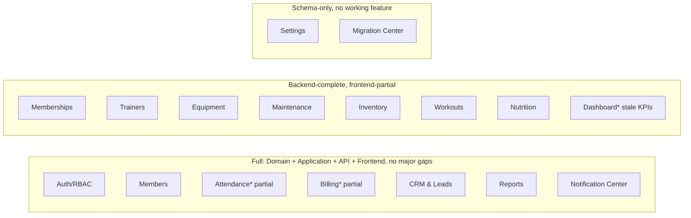
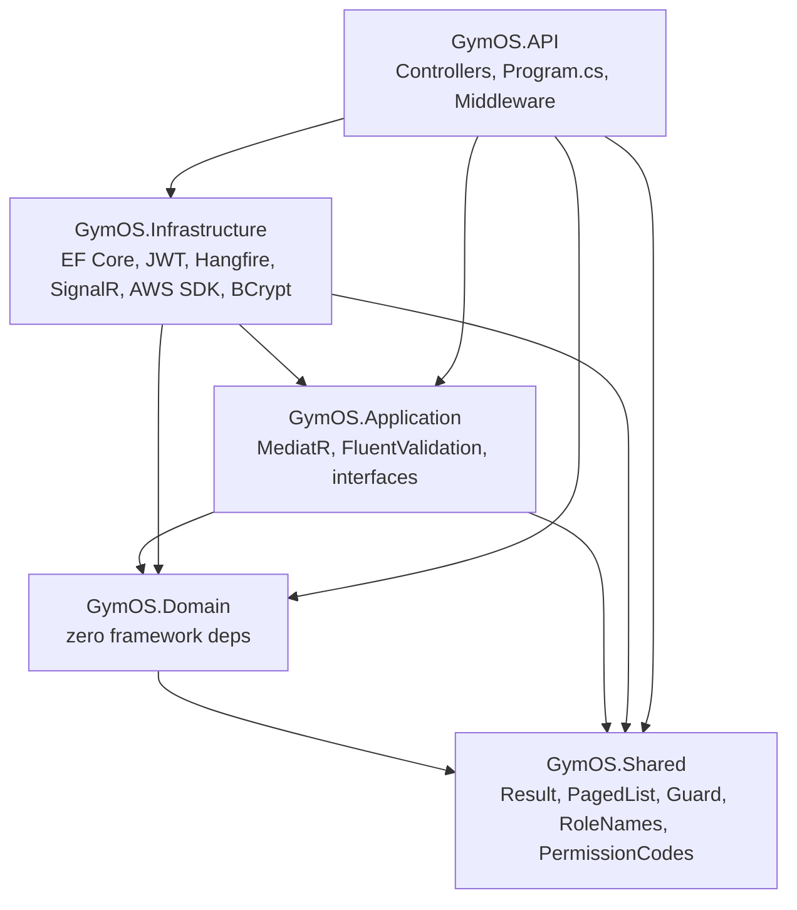

# GymOS — Current System Analysis (AS-IS)

> This document describes exactly what exists in the codebase at the time of writing. It is derived entirely from reading the source code, configuration files, and database migrations — not from the original specification (`docs/GymOS_MVP_Specification.md`), which describes *intended* scope and is explicitly excluded as a source of truth here. Where a claim cannot be verified from the code, it is marked **"Unable to Determine from Current Codebase"**. Where something described elsewhere (README, domain naming, permission catalog) does not actually exist in working code, it is marked **"Not Implemented"** explicitly.

---

## 1. Executive Summary

**What the application is.** GymOS is a multi-module gym-management web application: a REST API backend (ASP.NET Core / .NET 10) with a JWT-secured, permission-gated authorization model, and a single-page React frontend. It models a single fitness business ("Titan Fitness", 3 branches) and covers member management, billing/invoicing, attendance, CRM, staff/trainer management, equipment/maintenance, inventory, workouts, nutrition, reporting, and notifications.

**Primary purpose.** Based on code comments, README content, and architectural choices (demo-password seeding, no real payment gateway, in-app "Dev Mailbox" instead of real email/SMS), this is a **demo/MVP build for a sales or stakeholder demonstration**, not a production deployment. Every external integration point (payments, email/SMS/WhatsApp, object storage) is a simulated or no-op implementation behind an interface, explicitly designed to be swapped later without touching business logic. The connection string and JWT signing key committed to `appsettings.json` are dev-only placeholders, and the README explicitly frames the SDK/dependency choices as demo-appropriate rather than production-hardened.

**Current maturity level.** Mixed and uneven across modules and across layers within the same module:
- Backend business logic (CQRS handlers, validation, EF Core schema, RBAC enforcement) is comprehensive and consistently structured across all 16 conceptual modules.
- Several backend commands have **no corresponding frontend UI** at all (e.g. editing a member's profile, adding emergency contacts/medical notes/measurements/progress photos, issuing refunds, checking out of a facility, rating a trainer, recording equipment purchases, logging a workout, creating diet plans/meal entries/water logs, creating discounts/coupons). These are documented precisely in Section 19.
- Two modules (Migration Center, Settings) exist only as partial database schema scaffolding with little-to-no Application/API/frontend implementation.
- Automated test coverage is **zero** — all three backend test projects are empty scaffolds (test frameworks wired up, no test files), and the frontend has no test tooling installed at all.
- There is no CI/CD, no Docker, and no deployment automation of any kind.

**Major completed modules** (Domain + Application + API + Frontend, all working, browser-verified per commit history): Auth/RBAC, Dashboard, Members, Memberships, Attendance, Billing, CRM & Leads, Trainers, Equipment, Maintenance, Inventory, Workouts (partial — see gaps), Nutrition (partial — see gaps), Reports, Notification Center.

**Missing major systems:**
- **Migration Center**: Domain entities only (`ImportJob`, `ImportRow`, `ImportFieldMapping` + 3 enums). No Application-layer commands/queries, no controller, no frontend module.
- **Settings**: Domain entities exist (`GymProfile`, `SystemPreference`) but the Application layer only implements a single read-only branch-listing query. No gym-profile editing, no branch create/edit, no permission-matrix editor, no system-preference UI, and no frontend module at all.
- Automated testing (backend and frontend).
- CI/CD and containerization.

**Overall architecture quality.** The backend is a clean, consistently-applied Clean Architecture with genuine dependency inversion (Domain has zero framework dependencies; Infrastructure implementations are swapped via DI without touching Application code). The pattern is applied uniformly across all 16 modules — this is a real strength. Weaknesses are concentrated in: (a) three unused abstractions built but never adopted (`IRepository<T>`, `Result`/`Result<T>`, `Guard`), (b) two dead real-time/notification pathways (a SignalR hub with no publisher or subscriber, an MFA subsystem with no way to ever enable it), (c) a widening gap between backend capability and frontend surface area as the build progressed module-by-module, and (d) a handful of concrete security findings detailed in Section 16 (committed default credentials, an unauthenticated Hangfire dashboard, tenant-isolation gaps on several Wave 3 entities).

---

## 2. Technology Stack

### Frontend
- **Framework**: React 19.2.8 with TypeScript, built via Vite 8.2.0 (`@vitejs/plugin-react`).
- **Routing**: `react-router-dom` 6.30.4 (pinned below v7 deliberately — README states this avoids a set of v7 security advisories that are SSR/RSC-specific and don't apply to this pure client-side SPA).
- **Server state**: TanStack React Query 5.101.4 (`staleTime: 30_000`, `retry: 1`, `refetchOnWindowFocus: false` as global defaults).
- **Client/UI state**: Zustand 5.0.14, two stores (`authStore`, `uiStore`), both using the `persist` middleware (localStorage-backed, key names `gymos-auth` and `gymos-ui`).
- **Styling**: Tailwind CSS v4.3.3 via `@tailwindcss/vite` plugin; theme tokens defined as CSS custom properties in oklch color space in `src/index.css`, consumed through a Tailwind v4 `@theme inline` block; `tw-animate-css` for animation utilities; dark mode via a `.dark` class variant.
- **UI component library**: No CLI-managed shadcn/ui install exists. All 16 primitives under `src/components/ui/` (`button`, `input`, `label`, `card`, `badge`, `separator`, `skeleton`, `avatar`, `table`, `select`, `dialog`, `tabs`, `dropdown-menu`, `sonner`, `checkbox`, `textarea`) are hand-written, using `class-variance-authority` (cva) for variants and Radix UI primitives underneath (`@radix-ui/react-avatar`, `-checkbox`, `-dialog`, `-dropdown-menu`, `-label`, `-select`, `-separator`, `-tabs`, `-slot`).
- **Unused installed dependencies** (present in `package.json`, zero imports anywhere in `src/`): `@radix-ui/react-popover`, `@radix-ui/react-slider`, `@radix-ui/react-switch`, `@radix-ui/react-toast`, `jwt-decode`.
- **Real-time**: `@microsoft/signalr` 10.0.0 client, used by exactly one hook (`useDashboardHub`), connecting to `/hubs/dashboard`.
- **HTTP client**: `axios` 1.19.0, one shared instance (`apiClient`) with request/response interceptors (auth header injection, branch header injection, 401→refresh-token retry).
- **Charts**: No charting library is installed. The Reports module renders bars via a hand-built `SimpleBarChart` component using plain `<div>` height percentages, not a canvas/SVG charting library (e.g. no Recharts, Chart.js, Visx, etc.).
- **Forms/validation**: No form library (no react-hook-form, Formik, Zod). Every form is plain `useState` + native HTML `required`/`min`/`max`/`type` attributes + manual submit handlers.
- **Icons**: `lucide-react` 1.28.0.
- **Toasts**: `sonner` 2.0.7.
- **Linting**: `oxlint` 1.75.0 (not ESLint), configured via `.oxlintrc.json` with `react`, `typescript`, `oxc` plugins and two explicit rules (`react/rules-of-hooks: error`, `react/only-export-components: warn`).
- **TypeScript config**: project-references split (`tsconfig.json` → `tsconfig.app.json` + `tsconfig.node.json`); `tsconfig.app.json` sets `target: es2023`, `moduleResolution: bundler`, `noUnusedLocals`/`noUnusedParameters`/`noFallthroughCasesInSwitch`: true, `erasableSyntaxOnly: true` — **`strict` mode is not explicitly set** (defaults to off under `Nullable`-independent TS strictness; this project relies on the individual flags listed, not blanket `"strict": true"`).

### Backend
- **Runtime/Framework**: ASP.NET Core, target framework `net10.0` across every project. README explicitly flags the installed SDK as a **preview channel build** (`10.0.400-preview...`) and recommends a stable channel SDK for anything beyond local demo use.
- **Architecture**: Clean Architecture, 5 projects: `GymOS.Domain`, `GymOS.Application`, `GymOS.Infrastructure`, `GymOS.API`, `GymOS.Shared`, plus 3 test projects.
- **CQRS/Mediator**: MediatR 14.2.0. Every write is an `ICommand<TResponse>` (marker interface extending `IRequest<TResponse>`), every read an `IQuery<TResponse>`.
- **Validation**: FluentValidation 12.1.1 + `FluentValidation.DependencyInjectionExtensions`, auto-discovered per-assembly and run via a `ValidationBehavior<,>` MediatR pipeline behavior.
- **Background jobs**: Hangfire 1.8.24 (`Hangfire.AspNetCore`, `Hangfire.Core`) with `Hangfire.PostgreSql` 1.21.1 storage. Two recurring jobs registered (see Section 11).
- **Authentication**: Custom JWT (not ASP.NET Core Identity), `Microsoft.AspNetCore.Authentication.JwtBearer` 10.0.10, HMAC-SHA256 signing.
- **Password hashing**: `BCrypt.Net-Next` 4.2.1, work factor 12.
- **TOTP/MFA**: `Otp.NET` 1.4.1 — implemented in `TotpService` but **unreachable** in practice (Section 7).
- **Real-time**: `Microsoft.AspNetCore.SignalR.Core` 1.2.11, two hubs (`NotificationHub`, `DashboardHub`).
- **Excel export**: `ClosedXML` 0.105.1 — genuine `.xlsx` binary generation, not a placeholder.
- **Object storage abstraction**: `AWSSDK.S3` 4.0.101.6 for an S3-compatible backend, plus a local-disk implementation — **neither is ever invoked by any Application-layer command** (Section 13).
- **Demo data**: `Bogus` 35.6.5, fixed random seed (`20260803`) for reproducibility.
- **API documentation**: `Swashbuckle.AspNetCore` 9.0.6 (pinned down from the 10.x default specifically because 10.x pulls `Microsoft.OpenApi` 2.x, whose namespace restructuring breaks `OpenApiInfo`/`OpenApiSecurityScheme` references — 9.0.6 pins the classic stable `Microsoft.OpenApi` 1.6.25 API).
- **EF Core**: `Microsoft.EntityFrameworkCore` 10.0.10 + `Npgsql.EntityFrameworkCore.PostgreSQL` 10.0.3 + `Microsoft.EntityFrameworkCore.Design` 10.0.10 (design-time tooling for migrations).

### Database
- **Engine**: PostgreSQL (README specifies 16+; connection string default is `localhost:5432`).
- **Schema management**: EF Core Code-First migrations, 7 migration files applied to date (`InitialCreate`, `TrainerMemberRelations`, `EquipmentConfig`, `MaintenanceConfig`, `InventoryConfig`, `WorkoutsConfig`, `NutritionConfig`). Reports and Notifications introduced no schema changes (they only read existing tables).
- **No views, stored procedures, or triggers exist anywhere** — confirmed via full-repository search for `FromSqlRaw`/`ExecuteSqlRaw`/`CREATE VIEW`/`CREATE PROCEDURE`/`CREATE TRIGGER`: zero matches.

### ORM
EF Core, code-first. `GymOsDbContext` in `GymOS.Infrastructure/Persistence` implements the `IApplicationDbContext` interface defined in the Application layer (dependency inversion — Application depends only on its own interface, not on EF Core or Infrastructure). Table-level configuration (indexes, max lengths, delete behaviors, ignored computed properties) lives in 14 `IEntityTypeConfiguration<T>` classes under `Persistence/Configurations/`, auto-applied via `ApplyConfigurationsFromAssembly`. Two model-wide conventions are applied via reflection in `OnModelCreating`: (1) every enum property gets `HasConversion<string>()` so enum columns store human-readable strings, not integers; (2) every entity implementing `ITenantScoped` gets an automatic `HasQueryFilter` restricting rows to the current tenant, and every entity implementing `ISoftDelete` gets an automatic `IsDeleted == false` filter, combined with `AndAlso` if both apply.

### Authentication
Custom-built (not ASP.NET Core Identity): `User`/`Role`/`Permission`/`RolePermission`/`UserRole`/`UserBranchAccess`/`RefreshToken`/`PasswordResetToken` domain entities, JWT bearer tokens issued by `JwtTokenService`, permission resolution done per-request by `PermissionResolutionMiddleware`. Full detail in Section 7.

### State Management
Covered under Frontend above — TanStack Query for server state, Zustand+persist for client state. No Redux, no Context-API-based global state beyond what Query/Zustand provide.

### Third-Party Services
**None are actually connected.** Every external-service interface (`IPaymentGateway`, `IEmailSender`/`ISmsSender`/`IWhatsAppSender`, `IObjectStorage`) has only a demo/no-op/local implementation registered. No API keys, no webhook endpoints, no OAuth client configuration exist anywhere in the codebase for any real third party (Stripe, Twilio, SendGrid, etc.).

### Environment Variables / Configuration
- Backend: `appsettings.json` (committed to git) + `appsettings.Development.json` (gitignored, developer-created from `.example`). Config sections: `Logging`, `ConnectionStrings:GymOsDb`, `Jwt:{SigningKey,Issuer,Audience,AccessTokenLifetimeMinutes}`, `Storage:{Provider,LocalBasePath,PublicBaseUrl,S3BucketName,S3ServiceUrl,S3AccessKey,S3SecretKey}`, `Cors:AllowedOrigins` (string array).
- Frontend: `.env`/`.env.example` with a single variable, `VITE_API_BASE_URL`.
- **Security note**: `appsettings.json` (tracked in version control, NOT gitignored) contains a literal default connection-string password (`Password=postgres`) and a placeholder JWT signing key string (`"CHANGE_ME_IN_APPSETTINGS_DEVELOPMENT_LOCAL_ONLY_DO_NOT_USE_IN_PRODUCTION"`). See Section 16.

### Deployment
**Not Implemented.** No `Dockerfile`, no `docker-compose.yml`/`.yaml`, no `.github/workflows/`, no `azure-pipelines.yml`, no `.gitlab-ci.yml` exist anywhere in the repository (verified by direct filesystem search). The README documents a fully manual local setup: create the Postgres database by hand, copy the appsettings example, run `dotnet ef database update`, run `dotnet run -- --seed`, run the API, run `npm install && npm run dev`.

---

## 3. Project Structure

```
/GYM_OS
  README.md                          Manual setup instructions, architecture summary, demo logins
  .gitignore
  .claude/launch.json                 Dev-server launch config (Claude Code browser-preview tool only — not an app runtime file)
  /docs
    GymOS_MVP_Specification.md        Original target spec (NOT the current implementation — used for intent only)
  /backend
    GymOS.slnx                        Solution file — 5 src projects + 3 test projects
    Directory.Build.props             Shared MSBuild settings (Nullable, ImplicitUsings, LangVersion=latest, analyzers on)
    /src
      /GymOS.Domain                   Entities + enums, zero framework dependencies (references only GymOS.Shared)
      /GymOS.Application              CQRS handlers (MediatR), validators, DTOs, interfaces for every external dependency
      /GymOS.Infrastructure           EF Core, JWT, Identity, Messaging (demo senders), Payments (no-op), Storage (Local/S3), Reports (ClosedXML), RealTime (SignalR), BackgroundJobs (Hangfire), Seeding
      /GymOS.API                      Controllers, Authorization (permission policy plumbing), Middleware, Program.cs, appsettings*
      /GymOS.Shared                   Cross-cutting primitives: Result/Result<T>, PagedList<T>, Guard, RoleNames, PermissionCodes
    /tests
      /GymOS.Domain.Tests             xUnit+Shouldly wired via csproj — 0 test files
      /GymOS.Application.Tests        Same — 0 test files
      /GymOS.Api.IntegrationTests      xUnit+Shouldly+Mvc.Testing wired via csproj — 0 test files
  /frontend
    /src
      /app                            router.tsx (route table) — no separate App.tsx/providers file found beyond this
      /shared
        /components/layout            AppShell, Sidebar, Topbar, BranchSwitcher
        /components                   RequireAuth (auth guard), PageLoader, StatCard
        /hooks                        useDashboardHub (SignalR client)
        /nav                          modules.ts (NAV_MODULES — sidebar source of truth)
      /lib                            apiClient.ts (axios + interceptors), queryClient.ts, utils.ts (cn helper)
      /stores                         authStore.ts, uiStore.ts (Zustand + persist)
      /components/ui                  16 hand-rolled shadcn-style primitives
      /types                          auth.ts (CurrentUser/AuthResult), paging.ts (PagedList<T>)
      /modules                        One folder per business module (see below) — each with api/, components/, pages/
```

**Module folders under `frontend/src/modules/`** (15 total): `auth`, `dashboard`, `members`, `memberships`, `attendance`, `billing`, `crm`, `trainers`, `equipment`, `maintenance`, `inventory`, `workouts`, `nutrition`, `reports`, `notifications`. **No `settings` or `migration` folder exists.**

**Why organized this way.** The backend follows textbook Clean Architecture: Domain has no outward dependencies so business rules and entities are testable and framework-agnostic in principle (though in practice zero domain tests exist); Application defines every external-facing interface it needs (`IApplicationDbContext`, `IPaymentGateway`, etc.) so it never references Infrastructure directly; Infrastructure provides concrete implementations and is the only project referencing EF Core/Hangfire/SignalR/AWS SDK/BCrypt/etc.; API is a thin composition root plus HTTP-specific concerns (controllers, JWT bearer config, permission policies, exception-to-HTTP-status mapping). The frontend mirrors the backend's module boundaries one-to-one by folder name (e.g. `backend/.../Modules/Trainers` ↔ `frontend/src/modules/trainers`), which keeps API surface and UI surface easy to cross-reference, at the cost of some duplicated per-module boilerplate (every module repeats the same `api/`, `components/`, `pages/` shape and the same dialog/table/skeleton patterns rather than sharing more through a generic CRUD abstraction).

---

## 4. Architecture

**Architecture pattern**: Clean Architecture (Domain → Application → Infrastructure → API dependency direction) on the backend; a component-based SPA with a server-state/client-state split (TanStack Query / Zustand) on the frontend. CQRS is used throughout the Application layer via MediatR, though it is a **CQRS-lite** implementation — there is no separate read model/projection store; queries execute LINQ directly against the same tables commands write to.

**Layers**:
1. **Domain** — Plain C# classes/enums, no persistence or framework code. Common base types: `BaseEntity` (a `Guid Id`, `Equals`/`GetHashCode` by id+type), `IAuditable` (CreatedAt/CreatedByUserId/UpdatedAt/UpdatedByUserId), `ISoftDelete` (IsDeleted/DeletedAt), `ITenantScoped` (TenantId), `IBranchScoped` (extends `ITenantScoped`, adds BranchId). **`AggregateRoot`/`IHasDomainEvents`/`DomainEvent` are also defined here but are never used by any entity** — every entity in the codebase inherits `BaseEntity` directly and implements the scoping/auditing interfaces à la carte; none inherits `AggregateRoot` or raises domain events. This is a dead abstraction (a domain-events pattern that was scaffolded and never adopted).
2. **Application** — One folder per module under `Modules/`, each containing `Commands/`, `Queries/`, `Dtos/`, with validators defined inline in the same file as their command (not a separate `Validators/` folder in most modules). Cross-cutting: `Common/Behaviors` (4 MediatR pipeline behaviors), `Common/Interfaces` (every external dependency's contract), `Common/Exceptions` (`NotFoundException`, `ForbiddenAccessException`), `Common/Messaging` (`ICommand<T>`/`IQuery<T>` marker interfaces), `Common/Extensions` (`ToPagedListAsync`), `Common/TokenHasher` (SHA-256 hashing for high-entropy tokens).
3. **Infrastructure** — `Persistence` (DbContext + 14 entity configurations + migrations), `Identity` (password hashing, JWT issuance, TOTP, current-user resolution from claims), `Messaging` (3 demo notification senders that log to `NotificationLog`), `Payments` (`NoOpPaymentGateway`), `Storage` (`LocalDiskObjectStorage`/`S3ObjectStorage`), `Reports` (`ClosedXmlReportExporter`), `RealTime` (2 SignalR hubs + `DashboardNotifier`), `BackgroundJobs` (2 Hangfire jobs + a scheduler-service wrapper), `Seeding` (`DemoDataSeeder` + 3 partial classes).
4. **API** — 16 thin controllers (one per module, described fully in Section 10), `Authorization/` (permission-policy plumbing), `Middleware/` (2 middleware classes), `Program.cs` composition root.

**Modules**: 16 conceptual business modules. 14 are fully built end-to-end (Domain→Application→API→Frontend, with the caveats on partial frontend coverage noted throughout this document); 2 (Migration Center, Settings) are backend-schema-only or near-empty.

**Services**: Every cross-cutting capability is exposed as an interface in `GymOS.Application/Common/Interfaces` and implemented in `GymOS.Infrastructure`, registered in `DependencyInjection.cs` with explicit lifetimes:
- Singleton: `IDateTimeProvider`, `IPasswordHasher`, `IJwtTokenService`, `ITotpService`, `IPaymentGateway`, `IReportExporter`, `IObjectStorage` (Local or S3 depending on config).
- Scoped: `IApplicationDbContext` (→ `GymOsDbContext`), `ICurrentUserService`/`ITenantProvider`, `IEmailSender`/`ISmsSender`/`IWhatsAppSender`, `IDashboardNotifier`, `DemoDataSeeder`, the two Hangfire job classes, `INotificationSchedulerService`.

**Repositories**: `IRepository<T>` is defined in `Common/Interfaces/IRepository.cs` (`GetByIdAsync`/`AddAsync`/`Update`/`Remove`) but **is never referenced anywhere else in the entire backend** (confirmed by full-repository grep — zero matches outside its own declaration). Every command handler reads and writes directly through `IApplicationDbContext`'s `DbSet<T>` properties (e.g. `db.Members.Add(member); await db.SaveChangesAsync();`). This is a real inconsistency between the stated architectural intent (a repository abstraction over writes) and actual practice.

**Controllers**: 16 total, uniformly thin — every action is a 1-3 line method that constructs a Command/Query record, calls `mediator.Send(...)`, and wraps the result in `Ok()`, `NoContent()`, or `CreatedAtAction()`. No business logic, no direct EF Core access, no manual DTO mapping in any controller.

**Business Logic**: Entirely inside MediatR handlers. See Section 11 for enumerated business rules.

**Dependency Injection**: Composition root is `Program.cs`, calling `builder.Services.AddApplication()` (registers MediatR, FluentValidation validators, and 4 pipeline behaviors) then `builder.Services.AddInfrastructure(configuration)` (registers everything in Section "Infrastructure" above), then API-specific registrations (controllers with a global `JsonStringEnumConverter`, Swagger, JWT bearer auth, permission-policy-per-code, CORS).

**Data Flow / Request Flow / Response Flow** (traced from `Program.cs` middleware order):
1. HTTP request arrives.
2. `app.UseHttpsRedirection()`.
3. `app.UseCors("Frontend")` — origins from `Cors:AllowedOrigins` config, `AllowAnyHeader().AllowAnyMethod().AllowCredentials()`.
4. `app.UseMiddleware<ExceptionHandlingMiddleware>()` — wraps everything downstream in a try/catch that maps `ValidationException`→400, `NotFoundException`→404, `UnauthorizedAccessException`→401, `ForbiddenAccessException`→403, anything else→500 (logged), serialized as an RFC 7807 `ProblemDetails` JSON body.
5. `app.UseAuthentication()` — validates the JWT bearer token (issuer/audience/lifetime/signing-key checked, 30-second clock skew tolerance); for SignalR hub paths specifically, also accepts the token via an `access_token` query-string parameter (WebSocket connections can't set an Authorization header).
6. `app.UseMiddleware<PermissionResolutionMiddleware>()` — if the request is authenticated, runs one query joining `RolePermissions`→`UserRoles` for the current user, stashing the resulting list of permission-code strings on `HttpContext.Items["Permissions"]`.
7. `app.UseAuthorization()` — evaluates the `[RequirePermission("code")]` attribute on the target action, which is sugar for `[Authorize(Policy = "code")]`; each policy was registered 1:1 from `PermissionCodes.All` (via reflection) in `Program.cs`, and is satisfied by `PermissionAuthorizationHandler` checking `ICurrentUserService.Permissions` (which reads from the `HttpContext.Items` value populated in step 6 — no second database query).
8. Controller action executes, sends a Command/Query via `ISender.Send(...)`.
9. MediatR's pipeline runs the request through 4 behaviors in this fixed order (outermost first, per `GymOS.Application/DependencyInjection.cs`): `TenantScopeBehavior` (throws `ForbiddenAccessException` if the caller is authenticated but has no `tenant_id` claim) → `LoggingBehavior` (logs request name + user/tenant ids before and after) → `ValidationBehavior` (runs every registered `IValidator<TRequest>`, throws FluentValidation's `ValidationException` on failure) → `TransactionBehavior` (only applies to `ICommand<T>`, not queries — opens a real DB transaction via `Database.BeginTransactionAsync()`, commits on success, rolls back and rethrows on exception; short-circuits if a transaction is already open, so nested command calls from within a handler don't double-wrap).
10. The handler itself executes: queries read via `IApplicationDbContext`'s `DbSet<T>` LINQ (mostly `AsNoTracking()`, with EF Core's tenant global-query-filter automatically applied for any entity implementing `ITenantScoped`); commands mutate entities and call `SaveChangesAsync()`, which (in `GymOsDbContext`) auto-stamps `IAuditable.CreatedAt/CreatedByUserId` or `UpdatedAt/UpdatedByUserId` based on `ChangeTracker` entry state, and auto-fills `TenantId` on newly-added `ITenantScoped` entities from the current user's JWT claim if not already set.
11. Response DTO returned up through MediatR → controller → `Ok(...)`/etc. → serialized to JSON (enums as strings, via the global `JsonStringEnumConverter`).

**Frontend request flow**: A component calls a React Query hook → `apiClient` (axios) request interceptor attaches `Authorization: Bearer <accessToken>` (from `authStore`) and `X-Branch-Id` (from `uiStore.selectedBranchId`) headers → request sent → on a 401 response, the response interceptor triggers a single in-flight refresh (`refreshPromise` deduplication so concurrent 401s don't fire multiple refresh calls), retries the original request once with the new token, or redirects to `/login` if refresh fails → success response updates the React Query cache; mutations call `queryClient.invalidateQueries(...)` on success to refetch affected list/detail queries.

---

## 5. Database Analysis

**Schema management**: EF Core Code-First, PostgreSQL. No views, stored procedures, or triggers exist (confirmed empty via repo-wide search). Multi-tenancy is a discriminator-column model (`TenantId` on every tenant-scoped table, additionally `BranchId` on branch-scoped tables) — not schema-per-tenant or database-per-tenant.

**Global conventions** (applied in `GymOsDbContext.OnModelCreating`, not per-table):
- All enum-typed columns are stored as their string name (`HasConversion<string>()` applied reflectively to every enum property on every entity), not as integers.
- All `decimal` properties get `HasPrecision(18, 2)` globally (`ConfigureConventions`).
- A `HasQueryFilter` is added to every entity implementing `ITenantScoped`, restricting all queries to `TenantId == <current tenant from JWT>`, and a second filter clause `IsDeleted == false` is ANDed in for every entity additionally implementing `ISoftDelete`.
- **Branch is deliberately NOT filtered at the database level** — code comment in `GymOsDbContext.cs` states this is intentional so Owner/Manager roles can query across multiple branches; branch scoping is left as an optional, explicit `WHERE` clause added per-query in Application handlers (e.g. `GetMembersListQuery`'s optional `BranchId` filter parameter) rather than a blanket DB-level filter.

**⚠️ Tenant-isolation gap found**: The following entities do **not** implement `ITenantScoped` (or `IBranchScoped`), and therefore get **no automatic tenant filter at all** at the database layer: `MemberMembership`, `WorkoutTemplate` (implements `ITenantScoped` — has a filter), but critically **`WorkoutLog`, `WorkoutLogEntry`, `DietPlan`, `MealEntry`, `WaterLog` have no `TenantId` field and no scoping interface whatsoever**. Any query against these tables (e.g. `GetMemberWorkoutLogsQuery`, `GetMemberDietPlansQuery`) relies entirely on the caller filtering by a `MemberId` that was itself resolved from a tenant-scoped query elsewhere — there is no defense-in-depth at the schema/query-filter level for these five tables. `MemberMembership` similarly has no `TenantId`/`ITenantScoped`, relying on its `Member` navigation being tenant-scoped upstream.

### Tables (grounded in the 14 `IEntityTypeConfiguration` classes + entity definitions + `GymOsDbContext` `DbSet` list)

By convention, table names equal the `DbSet<T>` property names shown below (EF Core pluralization default, confirmed by the exact `DbSet` names in `GymOsDbContext`/`IApplicationDbContext`).

**Tenancy / Settings**
| Table | Key columns | Notes |
|---|---|---|
| `Tenants` | Id (PK), Name, Slug (unique), IsActive, audit fields | Root of multi-tenancy; never surfaced in the UI |
| `Branches` | Id (PK), TenantId (FK→Tenants), Name, AddressLine, City, Country, TimeZone, Currency, IsActive, audit fields | Index on TenantId |
| `GymProfiles` | Id (PK), TenantId, LegalName, DisplayName, LogoUrl, TaxId, SupportEmail, SupportPhone, DefaultCurrency, DefaultTimeZone | No Application query/command ever reads or writes this table (dead table from the application's perspective, populated only by the seeder) |
| `SystemPreferences` | Id (PK), TenantId, BranchId (nullable), Key, Value, Description | Never queried/written by any Application handler — dead table, no seed data either |

**Identity / RBAC**
| Table | Key columns | Notes |
|---|---|---|
| `Users` | Id (PK), TenantId, Email, PasswordHash, FirstName, LastName, Phone, IsActive, MfaEnabled, MfaSecret, LastLoginAt, IsDeleted, audit fields | Unique index on (TenantId, Email) |
| `Roles` | Id (PK), TenantId, Name, IsSystemRole | Unique index on (TenantId, Name) |
| `Permissions` | Id (PK), Code (unique, global — not tenant-scoped), Module, Description | 37 rows seeded (Section 6/7) |
| `RolePermissions` | Id (PK), RoleId (FK), PermissionId (FK) | Unique index on (RoleId, PermissionId) |
| `UserRoles` | Id (PK), UserId (FK), RoleId (FK, cascade) | Unique index on (UserId, RoleId) |
| `UserBranchAccesses` | Id (PK), UserId (FK), BranchId (FK, cascade) | Unique index on (UserId, BranchId) |
| `RefreshTokens` | Id (PK), UserId (FK, cascade), TokenHash (unique), CreatedAt, CreatedByIp, ExpiresAt, RevokedAt, RevokedByIp, ReplacedByTokenHash | `IsActive` computed property (Ignored in EF config, not a column) |
| `PasswordResetTokens` | Id (PK), UserId (FK, cascade), TokenHash (unique), CreatedAt, ExpiresAt, UsedAt | |

**Members**
| Table | Key columns | Notes |
|---|---|---|
| `Members` | Id (PK), TenantId, BranchId, UserId (nullable FK, SetNull), MemberCode, FirstName, LastName, DateOfBirth, Gender, Email, Phone, Address, ProfilePhotoUrl, JoinDate, Status (enum string), QrCodeToken, IsDeleted, audit fields | Unique index (TenantId, MemberCode); index on Email |
| `EmergencyContacts` | Id, MemberId (FK, cascade), Name, Relationship, Phone, Email | |
| `MedicalNotes` | Id, MemberId (FK, cascade), Note, RecordedByUserId, RecordedAt | |
| `MemberMeasurements` | Id, MemberId (FK, cascade), MeasuredOn, WeightKg, BodyFatPercentage, ChestCm, WaistCm, HipCm, ArmCm, ThighCm, Notes | |
| `ProgressPhotos` | Id, MemberId (FK, cascade), PhotoUrl, TakenAt, Notes | |
| `MemberMemberships` | Id, MemberId (FK, cascade), MembershipPlanId (FK, Restrict), StartDate, EndDate, Status (enum string), AutoRenew, FreezeStartDate, FreezeEndDate, PricePaid, Currency | Index on EndDate; **no TenantId/scoping interface** |

**Memberships**
| Table | Key columns | Notes |
|---|---|---|
| `MembershipPlans` | Id, TenantId, Name, Type (enum), Description, DurationDays, Price, Currency, MaxFreezeDays, IsActive, audit fields | |
| `Discounts` | Id, TenantId, MembershipPlanId (nullable FK, SetNull), Name, Type (enum: Percentage/FixedAmount), Value, ValidFrom, ValidTo, IsActive | |
| `Coupons` | Id, TenantId, Code, DiscountId (FK, cascade), MaxRedemptions, TimesRedeemed, ValidFrom, ValidTo, IsActive | Unique index (TenantId, Code); `IsRedeemable` computed, ignored |

**Billing**
| Table | Key columns | Notes |
|---|---|---|
| `Invoices` | Id, TenantId, BranchId, MemberId (FK, Restrict), InvoiceNumber, IssueDate, DueDate, Status (enum), Subtotal, TaxAmount, DiscountAmount, TotalAmount, Currency, Notes, audit fields | Unique index (TenantId, InvoiceNumber); `AmountPaid`/`AmountOutstanding` computed, ignored |
| `InvoiceLines` | Id, InvoiceId (FK, cascade), ItemType (enum), Description, Quantity, UnitPrice | `LineTotal` computed, ignored |
| `Payments` | Id, InvoiceId (FK, cascade), Method (enum), Amount, PaidAt, ReceivedByUserId, GatewayTransactionId (nullable), Status (enum) | |
| `Refunds` | Id, PaymentId (FK, Restrict), Amount, Reason, ApprovedByUserId, RefundedAt, Status (enum) | |
| `PaymentReminders` | Id, InvoiceId (FK, cascade), ScheduledFor, SentAt | **Table exists, but no Application command ever creates a row, and no background job ever processes one — fully dead table** |

**Attendance**
| Table | Key columns | Notes |
|---|---|---|
| `AttendanceRecords` | Id, TenantId, BranchId, MemberId (FK, Restrict), CheckInAt, CheckOutAt, Method (enum: QrSimulated/Manual), RecordedByUserId | Index on (MemberId, CheckInAt) |

**Notifications**
| Table | Key columns | Notes |
|---|---|---|
| `NotificationTemplates` | Id, TenantId, Code, Category (enum), Channel (enum), Subject, BodyTemplate, IsActive | 5 rows seeded |
| `ScheduledNotifications` | Id, TenantId, BranchId, NotificationTemplateId (FK), RecipientUserId (nullable), RecipientMemberId (nullable), ScheduledFor, Status (enum), RelatedEntityType, RelatedEntityId | Only ever populated by `MembershipExpiryCheckJob` in current code paths |
| `NotificationLogs` | Id, TenantId, ScheduledNotificationId (nullable), Channel (enum), RecipientAddress, Subject, Body, SentAt, Success, ErrorMessage | The "Dev Mailbox" — populated by the 3 no-op senders |

**Auditing**
| Table | Key columns | Notes |
|---|---|---|
| `AuditLogs` | Id, TenantId, UserId (nullable), Action, EntityType, EntityId, DataBefore, DataAfter, OccurredAt | **Table and entity exist; no Application command or infrastructure code ever writes a row — fully dead table, no seed data** |

**CRM**
| Table | Key columns | Notes |
|---|---|---|
| `Leads` | Id, TenantId, BranchId, FirstName, LastName, Email, Phone, Source (enum), Stage (enum), AssignedToUserId, ConvertedMemberId, Notes, audit fields | Index on (TenantId, Stage) |
| `LeadActivities` | Id, LeadId (FK, cascade), Type (enum), Notes, DueDate, CompletedAt, CreatedByUserId | |

**Trainers**
| Table | Key columns | Notes |
|---|---|---|
| `Trainers` | Id, TenantId, BranchId, UserId (FK, Restrict), Specialties, CommissionRate, Bio, IsActive | |
| `TrainerSchedules` | Id, TrainerId (FK, cascade), DayOfWeek, StartTime, EndTime, IsAvailable | Only seeded, never created/edited via any command |
| `TrainerAssignments` | Id, TrainerId (FK, cascade), MemberId (FK, Restrict), StartDate, EndDate, IsActive | |
| `TrainerRatings` | Id, TrainerId (FK, cascade), MemberId (FK, Restrict), Score, Comment, RatedAt | Command exists (`AddTrainerRatingCommand`) but no frontend UI calls it |
| `CommissionRecords` | Id, TrainerId (FK, cascade), InvoiceId (nullable, no FK constraint declared), Amount, Period, Status (enum: Pending/Paid) | Only seeded; no command ever creates or transitions a commission record |

**Equipment**
| Table | Key columns | Notes |
|---|---|---|
| `Assets` | Id, TenantId, BranchId, AssetTag, Name, Category, QrCodeToken, PhotoUrls (`List<string>`, EF Core primitive-collection column), ManualUrl, WarrantyExpiresAt, SupplierId (nullable FK, SetNull), Status (enum), PurchaseDate, PurchasePrice, Notes, audit fields | Unique index (TenantId, AssetTag). `PhotoUrls` can never actually be populated — no command accepts a value for it. |
| `Suppliers` | Id, TenantId, Name, ContactName, Phone, Email, Address | |

**Maintenance**
| Table | Key columns | Notes |
|---|---|---|
| `WorkOrders` | Id, TenantId, BranchId, AssetId (FK, Restrict), Type (enum), Priority (enum), Status (enum), Title, Description, AssignedToUserId, ScheduledDate, CompletedDate, Cost, audit fields | |
| `MaintenanceSchedules` | Id, AssetId (FK, cascade), RecurrenceRule (free-text string, not a parsed cron/RRULE), NextDueDate, IsActive | Command exists; no frontend UI calls it; nothing ever advances `NextDueDate` automatically |
| `DowntimeLogs` | Id, AssetId, WorkOrderId (nullable FK, SetNull), StartedAt, EndedAt, Reason | `Duration` computed, ignored |

**Inventory**
| Table | Key columns | Notes |
|---|---|---|
| `InventoryItems` | Id, TenantId, BranchId, Sku, Name, Category (enum), QuantityOnHand, ReorderLevel, UnitCost, UnitPrice, audit fields | Unique index (TenantId, Sku); `IsLowStock` computed, ignored |
| `StockMovements` | Id, InventoryItemId (FK, cascade), Type (enum: In/Out), Quantity, Reason, MovedAt, RecordedByUserId | |
| `PurchaseRecords` | Id, InventoryItemId (FK, cascade), SupplierId (nullable FK, SetNull), Quantity, UnitCost, PurchasedAt, InvoiceReference | Command exists; no frontend UI calls it |

**Workouts**
| Table | Key columns | Notes |
|---|---|---|
| `Exercises` | Id, TenantId, Name, MuscleGroup, Equipment, Description, VideoUrl | 15 seeded |
| `WorkoutTemplates` | Id, TenantId, Name, Description, CreatedByUserId | 0 seeded (created ad hoc during manual testing only) |
| `WorkoutTemplateExercises` | Id, WorkoutTemplateId (FK, cascade), ExerciseId (FK, Restrict), SetsCount, RepsCount, OrderIndex | |
| `WorkoutLogs` | Id, MemberId, WorkoutTemplateId (nullable), LoggedAt | **No TenantId/scoping interface** |
| `WorkoutLogEntries` | Id, WorkoutLogId (FK, cascade), ExerciseId, SetsCompleted, RepsCompleted, WeightKg | |

**Nutrition**
| Table | Key columns | Notes |
|---|---|---|
| `FoodItems` | Id, TenantId, Name, CaloriesPerServing, ProteinG, CarbsG, FatG, ServingSizeDescription | 12 seeded |
| `DietPlans` | Id, MemberId, Name, CreatedByUserId, TargetCalories, StartDate, EndDate | **No TenantId/scoping interface** |
| `MealEntries` | Id, DietPlanId (FK, cascade), FoodItemId (FK, Restrict), MealType (enum), Quantity, ConsumedAt | |
| `WaterLogs` | Id, MemberId, AmountMl, LoggedAt | **No TenantId/scoping interface** |

**Migration Center** (schema only — see Section 6/19)
| Table | Key columns | Notes |
|---|---|---|
| `ImportJobs` | Id, TenantId, EntityType (enum), FileName, FileUrl, Status (enum), TotalRows, ValidRows, DuplicateRows, ErrorRows, CommittedAt, RolledBackAt, audit fields | No command/query/controller reads or writes this table |
| `ImportRows` | Id, ImportJobId (FK), RowNumber, RawDataJson, ValidationErrors, IsDuplicate, DuplicateOfEntityId, MappedEntityId, Status (enum) | Same |
| `ImportFieldMappings` | Id, ImportJobId (FK), SourceColumnName, TargetFieldName | Same |

**Views / Stored Procedures / Triggers**: **Not Implemented** — none exist.

### Entity-Relationship Diagram (Mermaid)

```mermaid
erDiagram
    TENANT ||--o{ BRANCH : has
    TENANT ||--o{ USER : has
    TENANT ||--o{ ROLE : has
    TENANT ||--|| GYMPROFILE : has
    ROLE ||--o{ ROLEPERMISSION : grants
    PERMISSION ||--o{ ROLEPERMISSION : "granted via"
    USER ||--o{ USERROLE : has
    ROLE ||--o{ USERROLE : has
    USER ||--o{ USERBRANCHACCESS : "can access"
    BRANCH ||--o{ USERBRANCHACCESS : "accessible by"
    USER ||--o{ REFRESHTOKEN : issues
    USER ||--o{ PASSWORDRESETTOKEN : issues

    BRANCH ||--o{ MEMBER : has
    USER |o--o| MEMBER : "optional login for"
    MEMBER ||--o{ EMERGENCYCONTACT : has
    MEMBER ||--o{ MEDICALNOTE : has
    MEMBER ||--o{ MEMBERMEASUREMENT : has
    MEMBER ||--o{ PROGRESSPHOTO : has
    MEMBER ||--o{ MEMBERMEMBERSHIP : subscribes
    MEMBERSHIPPLAN ||--o{ MEMBERMEMBERSHIP : "sold as"
    MEMBERSHIPPLAN ||--o{ DISCOUNT : "applies to"
    DISCOUNT ||--o{ COUPON : redeemable_as

    MEMBER ||--o{ INVOICE : billed
    INVOICE ||--o{ INVOICELINE : contains
    INVOICE ||--o{ PAYMENT : receives
    PAYMENT ||--o{ REFUND : "refunded via"
    INVOICE ||--o{ PAYMENTREMINDER : schedules

    MEMBER ||--o{ ATTENDANCERECORD : "checks in"
    BRANCH ||--o{ ATTENDANCERECORD : at

    BRANCH ||--o{ LEAD : "sourced at"
    LEAD ||--o{ LEADACTIVITY : has

    USER ||--|| TRAINER : "is a"
    BRANCH ||--o{ TRAINER : "assigned to"
    TRAINER ||--o{ TRAINERSCHEDULE : has
    TRAINER ||--o{ TRAINERASSIGNMENT : has
    MEMBER ||--o{ TRAINERASSIGNMENT : "assigned to"
    TRAINER ||--o{ TRAINERRATING : receives
    MEMBER ||--o{ TRAINERRATING : gives
    TRAINER ||--o{ COMMISSIONRECORD : earns

    BRANCH ||--o{ ASSET : located_at
    SUPPLIER ||--o{ ASSET : supplies
    ASSET ||--o{ WORKORDER : requires
    ASSET ||--o{ MAINTENANCESCHEDULE : has
    ASSET ||--o{ DOWNTIMELOG : has
    WORKORDER ||--o{ DOWNTIMELOG : causes

    BRANCH ||--o{ INVENTORYITEM : stocked_at
    INVENTORYITEM ||--o{ STOCKMOVEMENT : has
    INVENTORYITEM ||--o{ PURCHASERECORD : has
    SUPPLIER ||--o{ PURCHASERECORD : supplies

    EXERCISE ||--o{ WORKOUTTEMPLATEEXERCISE : "used in"
    WORKOUTTEMPLATE ||--o{ WORKOUTTEMPLATEEXERCISE : contains
    WORKOUTTEMPLATE |o--o{ WORKOUTLOG : "based on"
    WORKOUTLOG ||--o{ WORKOUTLOGENTRY : contains
    MEMBER ||--o{ WORKOUTLOG : logs

    FOODITEM ||--o{ MEALENTRY : "used in"
    MEMBER ||--o{ DIETPLAN : has
    DIETPLAN ||--o{ MEALENTRY : contains
    MEMBER ||--o{ WATERLOG : logs

    NOTIFICATIONTEMPLATE ||--o{ SCHEDULEDNOTIFICATION : instantiates
    SCHEDULEDNOTIFICATION |o--o| NOTIFICATIONLOG : "dispatched as"

    IMPORTJOB ||--o{ IMPORTROW : contains
    IMPORTJOB ||--o{ IMPORTFIELDMAPPING : defines
```



*(Field lists are intentionally omitted from the diagram above for readability — see the table-by-table breakdown earlier in this section for exact columns.)*

---

## 6. Domain Model

Sixteen business domains exist as folders in `GymOS.Domain`. Maturity is annotated per domain (Full = Domain+Application+API+Frontend; Backend-only = Domain+Application+API with no/partial frontend; Schema-only = Domain entities exist with no Application layer).

| Domain | Maturity | Description |
|---|---|---|
| **Tenancy** | Full (invisible in UI by design) | `Tenant` + `Branch`. Single tenant seeded ("Titan Fitness"), 3 branches. Tenant is never surfaced in the UI — a SaaS-shaped schema serving a single-client demo. |
| **Identity/RBAC** | Full | `User`, `Role`, `Permission`, `RolePermission`, `UserRole`, `UserBranchAccess`, `RefreshToken`, `PasswordResetToken`. Custom-built, not ASP.NET Identity. |
| **Members** | Full | Member profiles, emergency contacts, medical notes, measurements, progress photos, membership history. Frontend covers create/list/detail/renew/freeze/transfer; **no edit-profile UI, no add-emergency-contact/medical-note/measurement/photo UI, no delete UI, no unfreeze/resume UI** despite backend commands existing for the first four. |
| **Memberships** | Backend-only for discounts/coupons | Plans (create/edit/list, full UI), Discounts/Coupons (create commands exist, **no list query, no frontend UI at all** — write-only capability with no way to view what was created). |
| **Billing** | Full for invoices/payments; backend-only for refunds | Invoices, invoice lines, payments (full CRUD+UI). Refunds: command exists (`IssueRefundCommand`), **no frontend trigger anywhere**. `PaymentReminder` table exists with zero code path ever populating or processing it. |
| **Attendance** | Full for check-in; backend-only for check-out/peak-hours | Check-in has full UI (simulated QR search-and-click). `CheckOutCommand` and `GetPeakHoursQuery` exist with **no frontend UI** — check-out time is always displayed as "—" in the table with no way to set it, and no peak-hours chart exists anywhere. |
| **CRM** | Full | Leads with a kanban-style stage board (Lead→FollowUp→Trial→Member→Lost), activities, pipeline conversion-rate summary. Fully wired end to end. |
| **Trainers** | Backend-only for schedules/commissions/ratings | Trainer creation (provisions a real `User`+`Trainer`, generates a temporary password), client assignment: full UI. `TrainerSchedule` and `CommissionRecord` are seed-only — no command ever creates/edits either from the app. `AddTrainerRatingCommand` exists with no frontend trigger. |
| **Equipment** | Backend-only for supplier creation | Assets: full create/list/status-update UI. Suppliers: list + create-command exist, but supplier *creation* has no dialog anywhere in the frontend (suppliers are seed-only in practice). |
| **Maintenance** | Backend-only for schedules | Work orders: full create/list/status-transition UI (auto-marks the asset `UnderMaintenance` on Corrective creation, auto-restores to `Active` and closes the open downtime log on Completed). `MaintenanceSchedule` create command exists with no frontend UI. |
| **Inventory** | Backend-only for purchase records | Items: full create/list/+/- stock-adjust UI. `RecordPurchaseCommand` (distinct from the generic stock-movement adjust) exists with no frontend UI — purchase history can only ever be seeded, not created live. |
| **Workouts** | Backend-only for logging | Exercise library and workout-template builder: full UI. `LogWorkoutCommand` and `GetMemberWorkoutLogsQuery` exist with **zero frontend usage anywhere** — a member's workout-log history feature is entirely unreachable from the UI. |
| **Nutrition** | Backend-only for diet plans | Food library: full create/list UI. `DietPlan`/`MealEntry`/`WaterLog` — all 3 commands (`CreateDietPlanCommand`, `AddMealEntryCommand`, `LogWaterCommand`) and 3 queries exist with **zero frontend usage** — diet-plan tracking is entirely backend-only. |
| **Reports** | Full | Revenue, attendance, and membership-breakdown reports have genuine backend aggregation queries plus real `.xlsx` export via ClosedXML. Trainer/Inventory/Equipment/Maintenance "report" tabs reuse each module's existing list endpoint and aggregate client-side in the browser (no dedicated backend report endpoint, no export button for these four). |
| **Notification Center** | Full | Dev Mailbox (log viewer), scheduled-notification viewer, template editor (subject/body/active toggle), a manual "Run checks now" trigger that synchronously runs the membership-expiry-check and dispatch jobs. |
| **Settings** | Schema-only | `GymProfile`/`SystemPreference` domain entities exist. Application layer implements exactly one query (`GetBranchesQuery`, used only to populate branch-selector dropdowns). **No gym-profile view/edit, no branch create/edit, no permission-matrix editor, no system-preference UI, and no frontend module folder at all.** |
| **Migration Center** | Schema-only | `ImportJob`/`ImportRow`/`ImportFieldMapping` domain entities + 3 enums exist. **Zero Application-layer commands/queries, no controller, no frontend module.** This is pure database scaffolding with no working feature behind it. |

**How domains interact**: Members is the hub most other domains reference — Billing (`Invoice.MemberId`), Attendance (`AttendanceRecord.MemberId`), CRM (`Lead.ConvertedMemberId`, informational only — nothing actually converts a lead into a Member record), Trainers (`TrainerAssignment`/`TrainerRating.MemberId`), Workouts (`WorkoutLog.MemberId`), Nutrition (`DietPlan`/`WaterLog.MemberId`) all point at `Member`. Branch is the secondary hub for Wave 2 operational domains (Equipment/Maintenance/Inventory scope assets and stock per branch). Identity/RBAC underlies every domain via `TenantId` scoping and permission checks, but has no direct foreign keys into business domains beyond `CreatedByUserId`/`AssignedToUserId`/`RecordedByUserId`-style audit references.

---

## 7. Authentication & Authorization

**Login flow** (`LoginCommand` in `Modules/Auth/Commands/LoginCommand.cs`): looks up the user by email with `IgnoreQueryFilters()` (login is pre-auth, so there is no ambient tenant to filter by) and `!IsDeleted`; rejects if the user is missing, inactive, or the BCrypt password check fails; **if `user.MfaEnabled` is true, requires and validates a TOTP code** via `ITotpService.ValidateCode` — but see the MFA finding below, this branch can never actually trigger in the current seeded/created data. On success: generates a JWT access token (claims: `sub`=UserId, `email`, `tenant_id`, `jti`, one `role` claim per role name — **no `permissions` claim is embedded in the token**), generates and stores a hashed refresh token (SHA-256, 7-day expiry), stamps `LastLoginAt`, and returns both tokens plus a `CurrentUserDto` (id/email/name/mfaEnabled/roles/permissions/accessibleBranchIds) resolved via `UserContextLoader`.

**Token management**: Access tokens are short-lived (20 minutes, `Jwt:AccessTokenLifetimeMinutes` config). Refresh tokens are rotating and revocable: `RefreshTokenCommand` looks up the token by its SHA-256 hash, validates it's active (not revoked, not expired) and its owning user is still active, revokes the old token (`RevokedAt` stamped) while linking it to the new one via `ReplacedByTokenHash`, and issues a brand-new access+refresh token pair. The frontend stores both tokens in `localStorage` (via Zustand's `persist` middleware, key `gymos-auth`) — **not an httpOnly cookie**, so both tokens are readable by any script executing in the page context (see Section 16).

**Permissions**: Resolved server-side per request, **not** embedded in the JWT. `PermissionResolutionMiddleware` runs once per authenticated request (after `UseAuthentication`, before `UseAuthorization`), executing a single query joining `RolePermissions` to the caller's `UserRoles`, and stashes the resulting list of permission-code strings on `HttpContext.Items["Permissions"]`. `ICurrentUserService.Permissions` reads from that stashed list; `HasPermission(code)` is a simple `Contains` check. This means permission changes (e.g. editing a role's permissions) take effect on the **very next request** — no token refresh or re-login needed, since permissions are never cached in the token itself.

**Roles**: 8 fixed role names (`RoleNames` in `GymOS.Shared`): Owner, Manager, Receptionist, Trainer, Nutritionist, Accountant, Maintenance, Member. Not user-creatable/editable — hardcoded and seeded once per tenant.

**Permission catalog**: 37 permission codes across 16 module groups (`PermissionCodes` in `GymOS.Shared`, discovered via reflection so `PermissionCodes.All` never drifts from the source of truth). Full catalog: `members.{view,create,update,delete,manage_membership}`, `memberships.{view,manage_plans,manage_discounts}`, `billing.{view,create_invoice,record_payment,issue_refund}`, `attendance.{view,check_in}`, `dashboard.view`, `settings.{view,manage_branches,manage_permissions,manage_gym_profile}`, `crm.{view,manage_leads}`, `trainers.{view,manage}`, `equipment.{view,manage}`, `maintenance.{view,manage}`, `inventory.{view,manage}`, `workouts.{view,manage}`, `nutrition.{view,manage}`, `reports.view`, `notifications.{view,manage}`, `migration.manage`.

**Guards / Policies**: `[RequirePermission("code")]` is a thin `AuthorizeAttribute` subclass where the policy name literally *is* the permission code. Every one of the 37 codes gets its own ASP.NET Core authorization policy, registered by iterating `PermissionCodes.All` in `Program.cs`. `PermissionAuthorizationHandler` succeeds the requirement if `ICurrentUserService.HasPermission(code)` is true — a direct list-contains check, no wildcard/hierarchy logic.

**Authorization model / RBAC implementation**: Standard role→permission→user chain via three join tables (`UserRole`, `RolePermission`, and the seeded `rolePermissionMap` in `DemoDataSeeder`). Owner gets all 37 permissions; Manager gets all except `settings.manage_permissions`; the other 6 roles get hand-picked subsets matching their job function (e.g. Receptionist gets member/billing/attendance/CRM permissions but not equipment/maintenance).

**⚠️ Orphaned permission codes**: `settings.view`, `settings.manage_branches`, and `settings.manage_gym_profile` are declared, seeded, and assigned to roles, but **no controller action anywhere checks any of them** (`BranchesController.List` has no `[RequirePermission]` attribute at all — just class-level `[Authorize]`, meaning *any* authenticated user, regardless of role, can list branches). These three permission codes currently have zero enforcement effect.

**MFA / TOTP**: `ITotpService` is fully implemented in Infrastructure (`GenerateSecret`, `GenerateQrCodeUri`, `ValidateCode` using `Otp.NET`) and the `User` entity has `MfaEnabled`/`MfaSecret` columns, and `LoginCommand` does check `MfaEnabled` and validate a code if so. **However, there is no command anywhere in the codebase that ever sets `MfaEnabled = true` or populates `MfaSecret`** (confirmed by repo-wide search), and the Login page has no MFA-code input field at all. MFA is fully unreachable in the running application — real infrastructure code with no way to activate it.

**Forgot-password / reset-password flow**: `ForgotPasswordCommand` always returns success (regardless of whether the email exists, to avoid leaking registered addresses), generates a random 256-bit token, hashes it, stores a `PasswordResetToken` (2-hour expiry), and calls `IEmailSender.SendAsync` with the **raw** token in the message body — since the email sender is a no-op that logs to `NotificationLog`, the reset token surfaces in the in-app "Dev Mailbox" (though the current Notification Center UI, built for the notification-template dispatch flow, is the only place `NotificationLog` rows are visible — the Forgot Password page's own copy references "Settings → Notifications, once available" which doesn't exist as a distinct feature). `ResetPasswordCommand` validates the token hash, non-used, non-expired, then re-hashes and sets the new password, marking the token used.

**Security weaknesses** (cross-referenced in Section 16): default committed DB credentials and JWT signing key placeholder in `appsettings.json`; JWT/refresh tokens in `localStorage` (XSS-exposed, not httpOnly); unauthenticated Hangfire dashboard; tenant-isolation gap on 5 tables (Section 5); no rate limiting on login/forgot-password endpoints (brute-force/enumeration risk, partially mitigated by the always-succeed response on forgot-password but not on login); `BranchesController` has no permission check at all.

---

## 8. UI Analysis

Below: every page found under `frontend/src/modules/*/pages/`, in route order.

| Route | Page | Purpose | Key components/forms | Filters | Dialogs |
|---|---|---|---|---|---|
| `/login` | LoginPage | Sign in | Email/password form, one-click demo-role email fill buttons | — | — |
| `/forgot-password` | ForgotPasswordPage | Request password reset | Email form | — | — |
| `/dashboard` | DashboardPage | Executive KPI overview | 6 `StatCard`s (revenue, cash, active members, new members, expiring-soon, check-ins today); live-updates via `useDashboardHub` SignalR subscription; static placeholder text box for Trainer/Equipment/Maintenance/Inventory widgets (stale — those modules have since shipped, see Section 20) | Branch (global, via BranchSwitcher) | — |
| `/members` | MembersListPage | Browse/search members | Search input, status `Select`, table with avatar/status badge | search term, status | CreateMemberDialog |
| `/members/:id` | MemberDetailPage | Member profile | Header card (avatar, contact info, QR token display), 5 tabs (Memberships/Measurements/Medical/Emergency/Photos — all **read-only** except Memberships) | — | RenewMembershipDialog, FreezeMembershipDialog (conditional on Active status), TransferMemberDialog |
| `/memberships` | MembershipsPage | Manage plan catalog | Card grid of plans | — | CreatePlanDialog |
| `/attendance` | AttendancePage | Check-in + visit history | CheckInPanel (member search → click to check in), history table | branch (global) | — (CheckInPanel is inline, not a modal) |
| `/billing` | InvoicesListPage | Invoice list | Table with status badges, outstanding-amount highlighting | — | CreateInvoiceDialog |
| `/billing/:id` | InvoiceDetailPage | Invoice detail | Line-items table, totals breakdown, payments table | — | RecordPaymentDialog (conditional on outstanding balance > 0) |
| `/crm` | CrmPage | Lead pipeline | Kanban board (5 stage columns), inline stage-change `Select` per card, conversion-summary card | branch (global) | CreateLeadDialog |
| `/trainers` | TrainersListPage | Trainer roster | Card grid (rating, client count, commission badge) | branch (global) | CreateTrainerDialog |
| `/trainers/:id` | TrainerDetailPage | Trainer profile | 4 tabs (Clients/Schedule/Ratings/Commissions — all **read-only** except Clients) | — | AssignClientDialog |
| `/equipment` | EquipmentPage | Asset registry | Table with inline status-change `Select` per row | — | CreateAssetDialog |
| `/maintenance` | MaintenancePage | Work orders | Table with inline status-change `Select`, overdue highlighting/count | — | CreateWorkOrderDialog |
| `/inventory` | InventoryPage | Stock levels | Table, low-stock badge/toggle-filter, inline +/- stock buttons | low-stock-only toggle | CreateInventoryItemDialog |
| `/workouts` | WorkoutsPage | Exercise & template library | 2 tabs (Exercise Library, Workout Templates) | — | CreateExerciseDialog, CreateWorkoutTemplateDialog (with inline exercise picker + sets/reps editor) |
| `/nutrition` | NutritionPage | Food library | Card grid (macros as badges) | — | CreateFoodItemDialog |
| `/reports` | ReportsPage | Analytics | 7 tabs (Revenue/Attendance/Membership/Trainers/Inventory/Equipment/Maintenance), CSS-bar charts, per-tab Excel export button (Revenue/Attendance/Membership only) | — | — |
| `/notifications` | NotificationsPage | Notification Center | 3 tabs (Dev Mailbox, Scheduled, Templates), "Run checks now" button | — | EditNotificationTemplateDialog |

**Not present as routes/pages**: `/settings`, `/migration` — both are absent from `router.tsx` entirely; their sidebar entries render as disabled "Soon" badges (`Sidebar.tsx` gates any nav item with `wave > 1` in `NAV_MODULES` regardless of whether the user has the corresponding permission).

**Navigation**: Single persistent left sidebar (`Sidebar.tsx`), driven entirely by the static `NAV_MODULES` array in `shared/nav/modules.ts`. Each entry has a `permission` string (hides the item if the current user lacks it) and a `wave` number (1 = active link, 2/3 = rendered as a disabled, "Soon"-badged div regardless of permission — currently only `migration` and `settings` are `wave: 3`; all 14 other modules are `wave: 1`).

**Responsive behavior**: The sidebar is hidden below the `md` breakpoint (`hidden ... md:flex`) with **no alternate mobile navigation (no hamburger menu, no bottom nav, no drawer)** — on a narrow viewport there is currently no way to navigate between modules at all except by directly editing the URL. Tables and card grids use Tailwind responsive grid classes (`grid-cols-1 sm:grid-cols-2 lg:grid-cols-3`) that do stack to a single column on mobile, but the sidebar gap is a genuine mobile-usability hole.

**Routing**: `react-router-dom` v6, a single `createBrowserRouter` call in `app/router.tsx`. Public routes (`/login`, `/forgot-password`) are unauthenticated. All other routes are nested under a `RequireAuth` element (redirects to `/login` if no access token is present in the Zustand store — **does not check token expiry, only presence**) wrapping an `AppShell` (sidebar+topbar layout) with an index redirect to `/dashboard`. Every page component is lazy-loaded (`React.lazy`) with a shared `PageLoader` fallback. A catch-all unmatched route is **not present** in the excerpt reviewed for this analysis beyond the nested structure — the router does not define a dedicated 404 page.

---

## 9. Existing Features

| Feature | Status | Completed % | Notes |
|---|---|---|---|
| Login / JWT auth / refresh-token rotation | Complete | 100% | Working end-to-end, MFA path unreachable (see §7) |
| Forgot/reset password | Complete | 100% | Reset link surfaces in Dev Mailbox, not real email |
| RBAC (8 roles, 37 permissions) | Complete | 100% | 3 Settings permission codes unenforced (dead) |
| Executive Dashboard | Partial | ~60% | 6 of 10 KPI fields wired to real data; 4 are hardcoded 0 with stale "coming soon" copy despite source modules shipping |
| Member registration/search/detail | Complete | 100% | |
| Member profile editing | Backend-only | 50% | `UpdateMemberCommand` exists, no frontend UI |
| Emergency contacts / medical notes / measurements / progress photos | Backend-only (read side only in UI) | 50% | 4 add-commands exist, all 4 display-only in UI, zero add-UI |
| Membership renew/freeze/transfer | Complete | 100% | No un-freeze/resume path anywhere |
| Membership plan catalog | Complete | 100% | |
| Discounts / Coupons | Backend write-only | 30% | Create commands exist, no list query, no UI at all |
| Attendance check-in | Complete | 100% | Simulated QR (search-and-click), not a camera scan |
| Attendance check-out | Backend-only | 40% | Command exists, zero frontend trigger |
| Peak-hours attendance analytics | Backend-only | 30% | Query+endpoint exist, no frontend chart |
| Invoicing / payment recording | Complete | 100% | |
| Refunds | Backend-only | 40% | Command exists, no frontend UI |
| Payment reminders | Not implemented | 0% | Table exists, nothing populates or sends |
| CRM lead pipeline (kanban) | Complete | 100% | |
| Trainer roster / client assignment | Complete | 100% | |
| Trainer schedule management | Not reachable | 10% | Seed-only, no command trigger from UI |
| Trainer ratings | Backend-only | 40% | Command exists, no UI |
| Trainer commissions | Not reachable | 10% | Seed-only, no generation/payout logic anywhere |
| Equipment asset registry | Complete | 100% | |
| Equipment suppliers | Backend-only for creation | 60% | List works; create-supplier has no dialog |
| Maintenance work orders | Complete | 100% | Auto asset-status transitions on create/complete |
| Maintenance recurring schedules | Backend-only | 30% | Create command exists, no UI, nothing auto-advances due dates |
| Inventory stock levels + quick adjust | Complete | 100% | |
| Inventory purchase records | Backend-only | 40% | Distinct `RecordPurchaseCommand` unused by frontend |
| Exercise library / workout templates | Complete | 100% | |
| Workout logging (per-member history) | Backend-only | 20% | Command+query exist, zero frontend usage |
| Food library | Complete | 100% | |
| Diet plans / meal entries / water logging | Backend-only | 20% | All 3 sub-features fully backed, zero frontend usage |
| Reports: Revenue/Attendance/Membership | Complete | 100% | Real aggregation + real `.xlsx` export |
| Reports: Trainer/Inventory/Equipment/Maintenance | Partial | 70% | Client-side aggregation of existing list data, no export |
| Notification Dev Mailbox | Complete | 100% | |
| Notification templates (edit) | Complete | 100% | |
| Notification scheduling (automatic) | Partial | 50% | Only membership-expiry generates schedules; Maintenance/Birthday/FollowUp/LowStock templates exist but nothing ever schedules them |
| Settings (gym profile, branches, permission matrix) | Not implemented | 5% | Only a read-only branch list exists; no UI module |
| Migration Center (CSV import) | Not implemented | 2% | Domain schema only, zero working logic |
| Audit logging | Not implemented | 0% | Table+entity exist, nothing ever writes a row |
| File uploads (photos, manuals) | Not implemented | 0% | Storage interfaces + 2 real implementations exist, never called by any command |
| Automated tests (backend) | Not implemented | 0% | 3 empty scaffold projects |
| Automated tests (frontend) | Not implemented | 0% | No test tooling installed |
| CI/CD | Not implemented | 0% | No pipeline config anywhere |
| Docker | Not implemented | 0% | No Dockerfile/compose anywhere |

---

## 10. API Analysis

Base path for all endpoints: `/api`. Authentication: all endpoints require a valid JWT bearer token except those explicitly marked `[AllowAnonymous]`. "Permission" = the exact `[RequirePermission]` policy code; "Authorize only" = `[Authorize]` with no specific permission (any authenticated user).

### AuthController (`/api/auth`)
| Method | Route | Auth | Input | Output | Validation |
|---|---|---|---|---|---|
| POST | `/login` | Anonymous | `{email, password, mfaCode?}` | `AuthResultDto` | email format, password non-empty |
| POST | `/refresh-token` | Anonymous | `{refreshToken}` | `AuthResultDto` | non-empty |
| POST | `/forgot-password` | Anonymous | `{email}` | 204 | email format |
| POST | `/reset-password` | Anonymous | `{token, newPassword}` | 204 | token non-empty, password min 8 chars |
| POST | `/change-password` | Authorize only | `{currentPassword, newPassword}` | 204 | password min 8 chars |
| GET | `/me` | Authorize only | — | `CurrentUserDto` | — |

**Errors**: invalid credentials/MFA/token → 401 (`UnauthorizedAccessException`); validation failures → 400 with field-grouped errors.

### DashboardController (`/api/dashboard`)
| GET | `/summary?branchId=` | `dashboard.view` | query param `branchId?` | `DashboardSummaryDto` (10 fields, 4 hardcoded to 0 — see §11) |

### BranchesController (`/api/branches`)
| GET | `` | Authorize only (no specific permission) | — | `List<BranchDto>` |

### MembersController (`/api/members`)
| GET | `` | `members.view` | searchTerm, status, branchId, page, pageSize (query) | `PagedList<MemberListItemDto>` |
| GET | `/{id}` | `members.view` | — | `MemberDetailDto` |
| POST | `` | `members.create` | `CreateMemberCommand` | Guid (201) |
| PUT | `/{id}` | `members.update` | `UpdateMemberCommand` | 204 |
| POST | `/{id}/emergency-contacts` | `members.update` | `AddEmergencyContactCommand` | Guid |
| POST | `/{id}/medical-notes` | `members.update` | `AddMedicalNoteCommand` | Guid |
| POST | `/{id}/measurements` | `members.update` | `AddMeasurementCommand` | Guid |
| POST | `/{id}/progress-photos` | `members.update` | `AddProgressPhotoCommand` | Guid |
| POST | `/{id}/memberships` | `members.manage_membership` | `RenewMembershipCommand` | Guid |
| POST | `/memberships/{memberMembershipId}/freeze` | `members.manage_membership` | `FreezeMembershipCommand` | 204 |
| POST | `/{id}/transfer` | `members.manage_membership` | `TransferMemberCommand` | 204 |

*(No DELETE endpoint despite `members.delete` permission code existing.)*

### MembershipsController (`/api/membership-plans`)
| GET | `` | `memberships.view` | includeInactive (query) | `List<MembershipPlanDto>` |
| POST | `` | `memberships.manage_plans` | `CreateMembershipPlanCommand` | Guid |
| PUT | `/{id}` | `memberships.manage_plans` | `UpdateMembershipPlanCommand` | 204 |
| POST | `/discounts` | `memberships.manage_discounts` | `CreateDiscountCommand` | Guid |
| POST | `/coupons` | `memberships.manage_discounts` | `CreateCouponCommand` | Guid |

*(No GET for discounts/coupons.)*

### AttendanceController (`/api/attendance`)
| GET | `` | `attendance.view` | memberId, branchId, fromDate, toDate, page, pageSize | `PagedList<AttendanceRecordDto>` |
| GET | `/peak-hours` | `attendance.view` | branchId, fromDate, toDate | `List<PeakHourBucketDto>` (24 hourly buckets) |
| POST | `/check-in` | `attendance.check_in` | `CheckInCommand` | Guid |
| POST | `/{id}/check-out` | `attendance.check_in` | — | 204 |

### BillingController (`/api/invoices`)
| GET | `` | `billing.view` | memberId, status, page, pageSize | `PagedList<InvoiceListItemDto>` |
| GET | `/{id}` | `billing.view` | — | `InvoiceDetailDto` |
| POST | `` | `billing.create_invoice` | `CreateInvoiceCommand` | Guid (201) |
| POST | `/{id}/payments` | `billing.record_payment` | `RecordPaymentCommand` | Guid |
| POST | `/payments/{paymentId}/refund` | `billing.issue_refund` | `IssueRefundCommand` | Guid |

### CrmController (`/api/leads`)
| GET | `` | `crm.view` | stage, branchId | `List<LeadListItemDto>` |
| GET | `/summary` | `crm.view` | branchId | `CrmPipelineSummaryDto` |
| GET | `/{id}` | `crm.view` | — | `LeadDetailDto` |
| POST | `` | `crm.manage_leads` | `CreateLeadCommand` | Guid (201) |
| PUT | `/{id}/stage` | `crm.manage_leads` | `UpdateLeadStageCommand` | 204 |
| POST | `/{id}/activities` | `crm.manage_leads` | `AddLeadActivityCommand` | Guid |

### TrainersController (`/api/trainers`)
| GET | `` | `trainers.view` | branchId | `List<TrainerListItemDto>` |
| GET | `/{id}` | `trainers.view` | — | `TrainerDetailDto` |
| POST | `` | `trainers.manage` | `CreateTrainerCommand` | `CreateTrainerResultDto` (includes temp password, 201) |
| POST | `/{id}/assignments` | `trainers.manage` | `AssignClientCommand` | Guid |
| POST | `/{id}/ratings` | `trainers.manage` | `AddTrainerRatingCommand` | Guid |

### EquipmentController (`/api/equipment`)
| GET | `` | `equipment.view` | branchId, status, category | `List<AssetListItemDto>` |
| GET | `/suppliers` | `equipment.view` | — | `List<SupplierDto>` |
| GET | `/{id}` | `equipment.view` | — | `AssetDetailDto` |
| POST | `` | `equipment.manage` | `CreateAssetCommand` | Guid (201) |
| POST | `/suppliers` | `equipment.manage` | `CreateSupplierCommand` | Guid |
| PUT | `/{id}/status` | `equipment.manage` | `UpdateAssetStatusCommand` | 204 |

### MaintenanceController (`/api/work-orders`)
| GET | `` | `maintenance.view` | branchId, status | `List<WorkOrderListItemDto>` |
| GET | `/schedules` | `maintenance.view` | branchId | `List<MaintenanceScheduleDto>` |
| GET | `/{id}` | `maintenance.view` | — | `WorkOrderDetailDto` |
| POST | `` | `maintenance.manage` | `CreateWorkOrderCommand` | Guid (201) |
| POST | `/schedules` | `maintenance.manage` | `CreateMaintenanceScheduleCommand` | Guid |
| PUT | `/{id}/status` | `maintenance.manage` | `UpdateWorkOrderStatusCommand` | 204 |

### InventoryController (`/api/inventory`)
| GET | `` | `inventory.view` | branchId, category, lowStockOnly | `List<InventoryItemListDto>` |
| GET | `/{id}` | `inventory.view` | — | `InventoryItemDetailDto` |
| POST | `` | `inventory.manage` | `CreateInventoryItemCommand` | Guid (201) |
| POST | `/{id}/movements` | `inventory.manage` | `RecordStockMovementCommand` | Guid |
| POST | `/{id}/purchases` | `inventory.manage` | `RecordPurchaseCommand` | Guid |

### WorkoutsController (`/api/workouts`)
| GET | `/exercises` | `workouts.view` | — | `List<ExerciseDto>` |
| POST | `/exercises` | `workouts.manage` | `CreateExerciseCommand` | Guid |
| GET | `/templates` | `workouts.view` | — | `List<WorkoutTemplateListItemDto>` |
| GET | `/templates/{id}` | `workouts.view` | — | `WorkoutTemplateDetailDto` |
| POST | `/templates` | `workouts.manage` | `CreateWorkoutTemplateCommand` | Guid (201) |
| GET | `/logs/member/{memberId}` | `workouts.view` | — | `List<WorkoutLogDto>` |
| POST | `/logs` | `workouts.manage` | `LogWorkoutCommand` | Guid |

### NutritionController (`/api/nutrition`)
| GET | `/food-items` | `nutrition.view` | — | `List<FoodItemDto>` |
| POST | `/food-items` | `nutrition.manage` | `CreateFoodItemCommand` | Guid |
| GET | `/diet-plans/member/{memberId}` | `nutrition.view` | — | `List<DietPlanListItemDto>` |
| GET | `/diet-plans/{id}` | `nutrition.view` | — | `DietPlanDetailDto` |
| POST | `/diet-plans` | `nutrition.manage` | `CreateDietPlanCommand` | Guid (201) |
| POST | `/diet-plans/{id}/meals` | `nutrition.manage` | `AddMealEntryCommand` | Guid |
| GET | `/water/member/{memberId}` | `nutrition.view` | — | `List<WaterLogDto>` |
| POST | `/water` | `nutrition.manage` | `LogWaterCommand` | Guid |

### ReportsController (`/api/reports`)
| GET | `/revenue?monthsBack=` | `reports.view` | — | `List<RevenueReportPointDto>` |
| GET | `/revenue/export?monthsBack=` | `reports.view` | — | `.xlsx` file |
| GET | `/attendance?daysBack=` | `reports.view` | — | `List<AttendanceReportPointDto>` |
| GET | `/attendance/export?daysBack=` | `reports.view` | — | `.xlsx` file |
| GET | `/membership-breakdown` | `reports.view` | — | `MembershipBreakdownDto` |
| GET | `/membership-breakdown/export` | `reports.view` | — | `.xlsx` file |

### NotificationsController (`/api/notifications`)
| GET | `/templates` | `notifications.view` | — | `List<NotificationTemplateDto>` |
| PUT | `/templates/{id}` | `notifications.manage` | `UpdateNotificationTemplateCommand` | 204 |
| GET | `/scheduled?status=` | `notifications.view` | — | `List<ScheduledNotificationDto>` |
| GET | `/logs` | `notifications.view` | — | `List<NotificationLogDto>` |
| POST | `/run-checks` | `notifications.manage` | — | `TriggerNotificationChecksResultDto` |

**Global error shape**: every unhandled exception is mapped by `ExceptionHandlingMiddleware` to an RFC 7807 `ProblemDetails` JSON body (`Status`, `Title`, and — for validation failures only — an `errors` dictionary keyed by property name). 500s are logged server-side; all other statuses are not.

**No Settings or Migration controllers exist.**

---

## 11. Business Logic

**Workflows**:
- **Member lifecycle**: register (auto-generates sequential `MBR-#####` code, sets Status=Active, generates a QR token) → renew/assign membership (computes end date from plan duration, applies an optional coupon's percentage/fixed discount, activates the member unless currently Frozen) → optionally freeze (validates the requested freeze span against the plan's `MaxFreezeDays`, sets both the membership and the member to Frozen) → optionally transfer branch.
- **Invoicing**: create invoice with arbitrary line items (subtotal = Σ qty×unitPrice, total = subtotal + tax − discount, floored at 0) → record payment (Cash/BankTransfer/Other post directly; Card routes through `IPaymentGateway.ChargeAsync`, which always succeeds with a fake transaction id) → invoice status auto-transitions to PartiallyPaid or Paid based on cumulative completed payments vs. total → refund (validates refund amount ≤ original payment amount, routes through `IPaymentGateway.RefundAsync` if the payment has a gateway transaction id, marks the invoice Refunded).
- **CRM pipeline**: Lead created at stage `Lead` → manually moved through `FollowUp`→`Trial`→`Member`/`Lost` via a `Select` dropdown (no workflow engine, no stage-transition validation — any stage can move to any other stage) → pipeline summary computes a simple conversion rate = MemberCount / TotalLeadCount × 100, rounded to 1 decimal.
- **Maintenance**: creating a `Corrective` work order automatically sets the asset to `UnderMaintenance` and opens a `DowntimeLog`; transitioning a work order to `Completed` automatically closes the open downtime log (`EndedAt` stamped) and restores the asset to `Active` if it was `UnderMaintenance`. `Preventive` work orders do **not** trigger any asset-status or downtime-log side effects.
- **Inventory**: stock movements (`RecordStockMovementCommand`) validate an `Out` movement doesn't exceed current `QuantityOnHand`; both `In`/`Out` adjust the running quantity directly. `RecordPurchaseCommand` is a separate, richer path (also creates a `PurchaseRecord` with supplier/cost/invoice-reference) that always increments quantity and also writes a `StockMovement` row with `Type=In` — the two commands overlap in effect but are not unified.
- **Notification dispatch**: `MembershipExpiryCheckJob` (daily) finds active memberships expiring within 7 days across every tenant, and for each one not already scheduled (dedup on `RelatedEntityType`+`RelatedEntityId`), creates a `ScheduledNotification` against the `membership-expiry-7-days` template. `NotificationDispatchJob` (every 5 minutes) picks up to 200 due (`ScheduledFor <= now`, `Status == Pending`) notifications, resolves the recipient (Member or User, address chosen by channel — Email vs. phone), **substitutes `{{FirstName}}`, `{{LastName}}`, and `{{ExpiryDate}}` placeholders** in the subject/body (resolved via the related `MemberMembership.EndDate` when `RelatedEntityType == "MemberMembership"`), dispatches through the channel-appropriate no-op sender (which writes to `NotificationLog`), and marks the notification Sent or Failed.
- **Auth**: see Section 7 in full.

**Rules** (validation, enforced via FluentValidation per-command): non-empty/max-length checks on nearly every string field; email format checks; `GreaterThan(0)`/`GreaterThanOrEqualTo(0)` on monetary/quantity fields; `InclusiveBetween` bounds (trainer commission rate 0-100, rating score 1-5); coupon percentage discounts capped at ≤100; freeze-span validated against plan's `MaxFreezeDays` inside the handler (not the validator); SKU/invoice-number/asset-tag/coupon-code uniqueness checked inside handlers via an `AnyAsync` existence query (not a DB unique-constraint-violation catch — see race-condition note in Section 20).

**Calculations**: invoice totals, coupon discount application (percentage vs. fixed), invoice amount-paid/outstanding (computed properties, EF-ignored, calculated server-side per query rather than stored), trainer average rating (in-query `Average()`), CRM conversion rate, dashboard today's-revenue/cash (summed from `Payment` rows within the UTC day boundary), report aggregations (monthly revenue buckets, daily attendance buckets, membership status/plan-type breakdowns).

**Automation**: 2 Hangfire recurring jobs (`membership-expiry-check` — `Cron.Daily`; `notification-dispatch` — `*/5 * * * *`). **No other automation exists** — no automated commission generation, no automated maintenance-schedule advancement, no automated payment-reminder sending, no automated low-stock/birthday/follow-up notification scheduling despite templates existing for all three.

**Scheduling**: Limited to the two Hangfire recurring jobs above, registered directly in `Program.cs` (not configurable via admin UI — no way to change the cron expressions without redeploying code).

**Notifications**: See Section 14/Dispatch workflow above. Only one of five seeded notification categories (`MembershipExpiry`) has an actual code path that ever schedules a notification; `Maintenance`, `Birthday`, `FollowUp`, and `LowStock` templates exist but nothing in the codebase ever creates a `ScheduledNotification` referencing them.

---

## 12. Database Operations

**CRUD**: Every module follows the same pattern — Create/Update commands mutate via `IApplicationDbContext`'s tracked `DbSet<T>` and call `SaveChangesAsync()`; List/Detail queries use `AsNoTracking()` LINQ projections directly into DTOs (no repository indirection, no AutoMapper — DTO construction is by-hand in every handler). **No Delete operations exist for any entity in the entire codebase** — not even soft-delete triggers (despite `ISoftDelete`/`IsDeleted` existing on `User` and `Member`, nothing ever sets `IsDeleted = true`; the flag is only ever read as a filter condition).

**Transactions**: Every `ICommand<T>` is automatically wrapped in a real database transaction by `TransactionBehavior` (commits on success, rolls back and rethrows on any exception), *unless* a transaction is already open (so a handler that calls another handler internally — none currently do — wouldn't double-wrap). `DemoDataSeeder.SeedAsync` additionally wraps its entire multi-step seed in one explicit transaction so a mid-seed failure can't leave a half-seeded tenant that would fool the idempotency check on retry.

**Caching**: **Not Implemented** anywhere in the backend (no `IMemoryCache`, no distributed cache, no Redis, no response caching middleware). The only "caching" in the system is `PermissionResolutionMiddleware` stashing permissions on `HttpContext.Items` for the lifetime of a single request (not cross-request) and TanStack Query's client-side cache (`staleTime: 30_000`) on the frontend.

**Queries**: Direct LINQ-to-Entities via EF Core, translated to SQL by Npgsql. Global tenant/soft-delete query filters apply automatically to every query unless explicitly bypassed with `.IgnoreQueryFilters()` (used deliberately in pre-auth contexts like login, and in cross-tenant background jobs).

**Pagination**: A single shared extension, `IQueryable<T>.ToPagedListAsync(page, pageSize, cancellationToken)` (`GymOS.Application/Common/Extensions/QueryableExtensions.cs`), clamps `page` to ≥1 and `pageSize` to the 1-200 range (defaulting to 20 outside that range), runs a `CountAsync()` then a `Skip/Take` materialization, and wraps both in a `PagedList<T>` (Items/Page/PageSize/TotalCount/TotalPages/HasNextPage/HasPreviousPage). Used by exactly 3 queries: `GetMembersListQuery`, `GetAttendanceHistoryQuery`, `GetInvoicesQuery`. Every other list query (Trainers, Equipment, Inventory, CRM, Maintenance, Workouts, Nutrition, Notifications, Reports) returns a plain unpaginated `List<T>` — a real inconsistency, especially for tables seeded with 50-100+ rows (Leads, Equipment, Inventory).

**Filtering**: Ad hoc, per-query optional parameters translated to conditional `.Where()` clauses (e.g. `BranchId`, `Status`, `Category`, date ranges, search-term `Contains()` matches across multiple string columns for Members). No generic filter/specification pattern — each query hand-rolls its own filter conditions.

**Sorting**: Fixed, hardcoded `OrderBy` per query (e.g. Members by FirstName/LastName, Invoices by IssueDate descending, Leads by CreatedAt descending) — **no client-controllable sort parameter exists on any endpoint.**

**Searching**: Only `GetMembersListQuery` supports free-text search (`SearchTerm`, matched via `.Contains()` against FirstName/LastName/Email/MemberCode — a client-evaluated-unsafe-for-index `LIKE '%term%'` pattern, not full-text search).

---

## 13. File Storage

**Uploads**: **Not Implemented** anywhere in the Application layer. `IObjectStorage` (Upload/Download/Delete/GetPublicUrl) is defined in `Common/Interfaces` and has two real, working Infrastructure implementations — `LocalDiskObjectStorage` (writes to `App_Data/uploads` on disk, serves via a configurable `PublicBaseUrl`) and `S3ObjectStorage` (real AWS SDK client against any S3-compatible endpoint, `ForcePathStyle: true` for MinIO compatibility) — selected at startup via the `Storage:Provider` config key (`Local` or `S3`). **However, zero command handlers in the entire Application layer ever inject or call `IObjectStorage`** (confirmed by repo-wide search: the only file referencing the interface is its own declaration). Every "photo/URL" field in the domain (`Member.ProfilePhotoUrl`, `ProgressPhoto.PhotoUrl`, `Asset.PhotoUrls`, `Asset.ManualUrl`) is a plain string column that must be populated with an already-hosted URL passed in from the client (e.g. `AddProgressPhotoCommand(MemberId, PhotoUrl, Notes)` takes the URL as a parameter, it does not accept file bytes) — there is no endpoint that accepts a multipart file upload anywhere in the API.
**Storage (as configured)**: Local-disk default, S3-compatible optional — both unreachable in practice per above.
**Image handling**: None — no resizing, no thumbnailing, no format validation, no virus scanning.
**Documents**: None — `Asset.ManualUrl` is a bare string field, same caveat as above.
**Exports**: Real — `.xlsx` generation via ClosedXML for the 3 Reports export endpoints (genuine binary files, not placeholders), returned as `application/vnd.openxmlformats-officedocument.spreadsheetml.sheet` file downloads.
**Imports**: **Not Implemented** — this is exactly the unbuilt Migration Center (Section 6/19); no CSV/Excel import parsing exists anywhere in the codebase.

---

## 14. Reporting

**Reports that exist and produce real backend-aggregated data + Excel export**:
1. **Revenue** — monthly totals of completed payments over a configurable trailing window (default 6 months), bucketed by calendar month.
2. **Attendance** — daily check-in counts over a configurable trailing window (default 30 days).
3. **Membership Breakdown** — member counts grouped by `MemberStatus`, and active-membership counts grouped by `MembershipPlanType`.

All three have a dedicated backend query, a dedicated `.xlsx` export endpoint (via a shared `IReportExporter.ExportToXlsx(sheetName, headers, rows)` abstraction backed by ClosedXML), and a frontend tab with a working "Export to Excel" button verified to return a genuine binary file.

**Reports that exist only as client-side aggregation of already-fetched list data (no dedicated backend endpoint, no export)**:
4. **Trainers** — reuses `GetTrainersListQuery`'s data, renders a plain HTML table (name, active clients, avg rating, commission rate, active/inactive badge).
5. **Inventory** — reuses `GetInventoryItemsListQuery`'s data, bar-charts quantity-on-hand per item, shows a low-stock count in the tab title.
6. **Equipment** — reuses `GetAssetsListQuery`'s data, bar-charts a count-by-status breakdown.
7. **Maintenance** — reuses `GetWorkOrdersListQuery`'s data, bar-charts a count-by-status breakdown, shows an overdue count.

**Charts**: All bar-style visualizations are rendered by a single hand-built `SimpleBarChart` component (`frontend/src/modules/reports/components/SimpleBarChart.tsx`) using proportionally-scaled `<div>` heights — **no charting library is used anywhere** (confirmed: no Recharts/Chart.js/Visx/D3 in `package.json`).

**KPIs**: Dashboard exposes 10 KPI fields (Section 9/11) — 6 are live-computed, 4 (`trainerScheduleTodayCount`, `equipmentAlertsCount`, `maintenanceRemindersCount`, `inventoryAlertsCount`) are hardcoded to `0` in `GetDashboardSummaryQueryHandler` with an explanatory code comment stating this was intentional pending Wave 2/3 modules shipping — those modules have since shipped, but the query was never updated to compute real values, and the frontend still shows placeholder copy referencing "Wave 2" as if it hasn't happened yet.

**Analytics**: `GetPeakHoursQuery` (24 hourly attendance buckets over a date range) exists as a real backend endpoint but is **not surfaced anywhere in the frontend** — no page or component calls it.

---

## 15. Integrations

**No real third-party integration is connected anywhere in this codebase.** Every integration point is an interface with a demo/simulated/local implementation:

| Interface | Real implementation exists? | Actual behavior today |
|---|---|---|
| `IPaymentGateway` | No | `NoOpPaymentGateway` — every charge/refund call always succeeds instantly with a deterministic fake transaction id (`DEMO-TXN-{guid}` / `DEMO-REFUND-{guid}`). No Stripe/Mollie/PayPal/SEPA SDK or client is referenced anywhere. |
| `IEmailSender` / `ISmsSender` / `IWhatsAppSender` | No | All three write to the `NotificationLogs` table (the "Dev Mailbox") instead of sending anything. No SMTP client, no Twilio SDK, no SendGrid SDK, no WhatsApp Business API client exists anywhere. |
| `IObjectStorage` | Partially (code is real, never invoked) | `LocalDiskObjectStorage` writes real files to disk; `S3ObjectStorage` is a real, working AWS SDK v4 client — but **no Application command ever calls either one** (Section 13). No credentials for a real bucket are configured. |
| Maps | Not Implemented | No mapping library, no geocoding call, anywhere. |
| AI | Not Implemented | No LLM/AI SDK dependency anywhere. |
| Analytics (Segment/Mixpanel/GA) | Not Implemented | None. |
| Push notifications (mobile) | Not Implemented | None — the only "push" is the SignalR dashboard-activity broadcast, which is same-origin real-time, not a third-party push service. |
| SSO/OAuth (Google/Microsoft login) | Not Implemented | Auth is entirely email+password against the app's own `Users` table. |

**Real-time (SignalR)** is the one genuinely-working, in-process "integration": `DashboardHub` broadcasts an `"activity"` event to a per-branch group whenever a check-in (`CheckInCommand`) or payment (`RecordPaymentCommand`) occurs, and the frontend's `useDashboardHub` hook invalidates the dashboard-summary query on receipt — this is a real, working live-update feature. `NotificationHub` is mapped as an endpoint and clients can join a tenant group via `JoinTenantGroup`, but **no server-side code anywhere ever pushes to it** (no `IHubContext<NotificationHub>` is injected by any command or job), and **no frontend code ever connects to it** — a fully dead real-time channel, wired up on both the hub-mapping and client-package level but never actually used in either direction.

---

## 16. Security Review

| # | Finding | Area | Severity |
|---|---|---|---|
| 1 | `appsettings.json` (tracked in git, not gitignored) contains a literal default database password (`Password=postgres`) and a placeholder JWT signing key string (`"CHANGE_ME_IN_APPSETTINGS_DEVELOPMENT_LOCAL_ONLY_DO_NOT_USE_IN_PRODUCTION"`) committed to source control. Anyone who reads the repository has the exact string that would sign/verify JWTs if this file is ever used unmodified. | Secrets management | **Critical** (if ever deployed with this file unedited) |
| 2 | `app.UseHangfireDashboard("/hangfire")` is registered in `Program.cs` with **no authorization filter** — the default Hangfire dashboard middleware (job list, ability to trigger/delete jobs) is reachable by anyone who can route to that path, with zero authentication check. | Authorization | **High** |
| 3 | JWT access token and refresh token are both persisted in `localStorage` via Zustand's `persist` middleware (`gymos-auth` key) — readable by any script executing in the page (XSS), not protected by `httpOnly`/`SameSite` cookie semantics. | Session management | **High** |
| 4 | Five database tables (`WorkoutLog`, `WorkoutLogEntry`, `DietPlan`, `MealEntry`, `WaterLog`) implement neither `ITenantScoped` nor `IBranchScoped`, so EF Core's automatic tenant query filter does not apply to them at all — isolation depends entirely on every current and future query correctly filtering by a tenant-scoped `MemberId` upstream, with no defense-in-depth at the schema layer. | Multi-tenancy / data isolation | **High** |
| 5 | `BranchesController.List` has no `[RequirePermission]` attribute — any authenticated user of any role can enumerate all branches, regardless of the `settings.view` permission that exists specifically to gate this. | Authorization | **Medium** |
| 6 | No rate limiting exists on `/api/auth/login`, `/api/auth/forgot-password`, or any other endpoint — no lockout, no CAPTCHA, no throttling middleware anywhere in `Program.cs` or elsewhere. Brute-force and email-enumeration-via-timing risk on login. | Input/abuse protection | **Medium** |
| 7 | SKU/invoice-number/asset-tag/coupon-code uniqueness is checked via an `AnyAsync()` existence query inside the handler, not enforced by a database unique constraint being the sole gate combined with proper conflict handling — a race condition between two concurrent requests could both pass the existence check and violate the (separately-declared) unique index, surfacing as an unhandled 500 rather than a clean validation error. (The unique indexes themselves *do* exist per Section 5, so data integrity is preserved, but the user-facing error handling for the collision path is not graceful.) | Input validation / error handling | **Low** |
| 8 | `ForgotPasswordCommand` correctly avoids leaking account existence (always returns success), but `LoginCommand` returns a generic 401 without any delay/backoff — enables online brute-forcing at whatever rate the network allows. | Authentication | **Medium** |
| 9 | CORS policy uses `AllowCredentials()` combined with an explicit `AllowedOrigins` list (not a wildcard) — this specific combination is correctly configured (ASP.NET Core would reject `AllowAnyOrigin()+AllowCredentials()` at startup), so this is **not** a finding, noted here only because it was checked. | CORS | N/A (verified safe) |
| 10 | Password hashing uses BCrypt work factor 12 — a reasonable, currently-adequate cost factor. Token hashing (refresh/reset tokens) uses fast SHA-256, which is appropriate specifically because those tokens are high-entropy random values, not human-chosen passwords (a deliberate, correctly-reasoned choice per the code comment in `TokenHasher.cs`). | Cryptography | N/A (verified safe) |
| 11 | SQL injection: **Not applicable/no risk found** — every single database access in the codebase goes through EF Core's LINQ provider; a full-repository search for `FromSqlRaw`/`ExecuteSqlRaw`/string-concatenated SQL returned zero matches. | SQL injection | N/A (verified safe) |
| 12 | XSS: React's default JSX escaping is used throughout; no `dangerouslySetInnerHTML` usage was observed in any reviewed component. Not exhaustively verified against every file in the repository, but no instance was found in the substantial sample read for this analysis. | XSS | Unable to Determine exhaustively — no instances found in files reviewed |
| 13 | CSRF: Not applicable in the traditional cookie-session sense, since auth is bearer-token-in-header based (not ambient cookies), which inherently resists classic CSRF. No CSRF token mechanism exists, but none is needed under this auth model. | CSRF | N/A (verified safe under current auth model) |
| 14 | Logging: `LoggingBehavior` logs the request type name plus the caller's UserId/TenantId for every command/query — no sensitive field values (passwords, tokens) are logged based on the files reviewed. Exception logging in `ExceptionHandlingMiddleware` only logs full exception details for 500-class errors. | Logging | N/A (verified safe in reviewed code) |
| 15 | No audit trail exists despite an `AuditLog` table/entity being defined — no security-relevant action (login, permission change, refund, member deletion) is ever recorded to it. | Auditability | **Medium** (compliance/forensics gap, not an exploitable vulnerability) |

---

## 17. Performance Review

**Rendering**: Every route-level page component is lazy-loaded (`React.lazy`) — genuine code-splitting exists at the page level. No component-level `React.memo`/`useMemo`/`useCallback` optimization was observed in the reviewed files (forms and lists re-render fully on every parent state change); given the current data volumes (dozens to a few hundred rows per list) this is unlikely to be a real problem today but would not scale to significantly larger datasets without revisiting.

**Database**: 
- Most list queries are unpaginated (`List<T>`, not `PagedList<T>` — Section 12), meaning e.g. the Equipment (80 seeded rows), Inventory (~100 seeded rows), and CRM Leads (50 seeded rows) endpoints always return their entire result set. At current seed volumes this is fine; it will not scale gracefully as those tables grow into the thousands.
- **N+1 query risk**: `GetTrainerByIdQuery` and `GetWorkOrderByIdQuery`-style detail queries use `.Include()`/`.ThenInclude()` correctly (single round-trip with joins), so no N+1 pattern was found in the detail-query paths reviewed. `GetMemberWorkoutLogsQuery` and `GetDietPlanByIdQuery` build a name-lookup `Dictionary` via a *second* batched query (not per-row) after materializing the first result set — this is a reasonable 2-query pattern, not N+1.
- No database indexes beyond what's declared in the 14 `IEntityTypeConfiguration` classes (Section 5) — these cover the obvious unique-constraint and common-filter columns (TenantId+Code-style composites, Email, EndDate, Stage) but there is no index on, for example, `Invoice.Status`, `WorkOrder.Status`, or `Asset.Status`, all of which are filtered on directly in list queries.
- No query result caching anywhere (Section 12).

**API**: No response caching, no ETags, no compression middleware (`UseResponseCompression` is not called in `Program.cs`) — every JSON response is sent uncompressed.

**Caching**: Not Implemented (Section 12) beyond TanStack Query's 30-second client-side stale time and Hangfire's own internal polling.

**Lazy loading**: Route-level only (frontend); no incremental/virtualized list rendering anywhere (no `react-window`/`react-virtual` — every table renders its full unpaginated or single-page result set as real DOM rows).

**Code splitting**: Present at the route level via `React.lazy` + `Suspense`; not present at the component level within a page.

**Large components**: `MemberDetailPage.tsx` and `WorkoutsPage.tsx`-style pages combine several tabs/sections in one file (~180 and ~80 lines respectively) but are not excessively large by React conventions; no single component reviewed exceeded a few hundred lines.

**Memory usage**: Not measurable from static analysis. `Unable to Determine from Current Codebase` — no profiling data, load-testing scripts, or memory-usage documentation exists in the repository.

**Potential bottlenecks**: (a) unpaginated list endpoints as data grows past seed volumes; (b) the `PermissionResolutionMiddleware` query running on *every* authenticated request (not cached even within a single user's session across requests) — acceptable at current scale, a real cost at high request volume; (c) `GetMembersListQuery`'s free-text search using `.Contains()` (translates to `LIKE '%term%'`, which cannot use a standard b-tree index prefix and will degrade linearly with table size); (d) Hangfire's `NotificationDispatchJob` runs every 5 minutes regardless of whether there's anything to dispatch — negligible at current volume, a fixed background-load cost regardless of demand.

---

## 18. Code Quality Review

**Folder organization**: Consistently mirrors business modules across all four backend layers and the frontend, one-to-one, using identical naming (`Trainers`/`trainers`, `Crm`/`crm`, etc.) — a genuine strength for discoverability and onboarding.

**Naming**: Consistent C# PascalCase/camelCase conventions throughout backend; consistent TypeScript conventions (PascalCase components/types, camelCase functions/variables) throughout frontend. Command/Query/Dto/Validator/Handler naming follows one fixed pattern with zero deviation across ~90 backend command/query files reviewed.

**Reusability**: Mixed. Strong reuse of cross-cutting primitives (`PagedList<T>`, the 4 MediatR behaviors, the permission-attribute pattern, the shadcn-style UI primitives). Weak reuse *within* similar features — nearly every module's "Create___Dialog.tsx" component independently re-implements the same `useState`-per-field + manual-submit-handler + toast-on-success/error pattern rather than sharing a generic form abstraction; every module's list page independently re-implements its own skeleton-loading/empty-state table markup.

**SOLID**: 
- **Single Responsibility**: strongly honored at the handler level — every command/query handler does exactly one thing.
- **Open/Closed**: reasonably honored via the interface-per-external-dependency pattern (payment/storage/messaging can be swapped without touching Application code) — though this promise is currently *unexercised* since none of the swappable pieces (`IObjectStorage`, real `IPaymentGateway`) are ever called from Application in the first place.
- **Liskov/Interface Segregation**: interfaces are narrow and single-purpose (`IDateTimeProvider` is one property, `IPasswordHasher` is two methods) — well segregated.
- **Dependency Inversion**: the strongest-honored principle in this codebase — Domain has zero outward dependencies, Application depends only on its own interfaces, and this is verified rather than just claimed (checked via `GymOS.Domain.csproj`'s single `ProjectReference` to `GymOS.Shared` only, and `GymOS.Application.csproj`'s references being limited to `Domain`+`Shared`).

**DRY**: Violated in the frontend dialog/list-page pattern (above). Backend command handlers each hand-roll their own tenant-guard clause (`currentUser.TenantId ?? throw new ForbiddenAccessException(...)`) rather than centralizing it — though `TenantScopeBehavior` already centrally guards "authenticated-but-no-tenant-claim," so the per-handler check is partially redundant with the pipeline behavior.

**Maintainability**: Good within any single module (easy to find and reason about one module's slice of Domain/Application/API/Frontend); increasingly strained across modules as evidenced by the Dashboard's stale hardcoded-zero KPIs (Section 20) — no mechanism exists to catch "module X shipped but dependent code Y wasn't updated" other than manual review.

**Technical debt**: Enumerated exhaustively in Section 22.

**Dead code** (confirmed via repo-wide search, not assumption):
- `IRepository<T>` interface — declared, zero usages.
- `Result`/`Result<T>` classes (`GymOS.Shared`) — declared, zero usages.
- `Guard` static class (`GymOS.Shared`) — declared, zero usages.
- `AggregateRoot`/`IHasDomainEvents`/`DomainEvent` (`GymOS.Domain.Common`) — declared, zero entities inherit/use them.
- `NotificationHub` — mapped as an endpoint, zero server-side publishers, zero frontend subscribers.
- `IObjectStorage` and both its implementations — fully implemented, zero callers.
- `ITotpService`/MFA fields on `User` — fully implemented, zero code path ever enables MFA.
- `GymProfileDto` (`Modules/Settings/Dtos`) — declared, zero query/command ever constructs or returns one.
- `AuditLog` entity/table — zero writers.
- `PaymentReminder` entity/table — zero writers, zero readers beyond the seed-time table creation.
- 5 unused npm dependencies (Section 2).

**Duplicated logic**: The stock-adjustment (`RecordStockMovementCommand`) and stock-purchase (`RecordPurchaseCommand`) paths both increment `InventoryItem.QuantityOnHand` and both write a `StockMovement` row, via separately-written, non-shared logic.

**Large classes/components**: No single file reviewed was excessively large (largest components observed were in the 150-220 line range) — this is not currently a problem in this codebase.

---

## 19. Missing Features

Based strictly on what exists in the current codebase (not the original spec):

**Features with backend logic but zero frontend entry point** (the most common gap pattern in this codebase):
- Edit an existing member's profile (`UpdateMemberCommand`)
- Add emergency contact / medical note / measurement / progress photo to a member (4 commands)
- Un-freeze / resume a frozen membership (no command exists at all — this is a workflow gap, not just a UI gap)
- List/view discounts and coupons after creating them (no query exists — write-only capability)
- Check out of a facility (`CheckOutCommand`)
- View peak-hours attendance analytics (`GetPeakHoursQuery`)
- Issue a refund (`IssueRefundCommand`)
- Rate a trainer (`AddTrainerRatingCommand`)
- Manage a trainer's weekly schedule (no command exists to create/edit `TrainerSchedule` outside seeding)
- Generate or mark a trainer commission as paid (no command exists at all for `CommissionRecord` beyond seeding)
- Create a supplier (`CreateSupplierCommand` — supplier list works, creation dialog doesn't exist)
- Create/manage a recurring maintenance schedule (`CreateMaintenanceScheduleCommand`)
- Record an inventory purchase distinct from a quick stock adjustment (`RecordPurchaseCommand`)
- Log an individual workout session / view a member's workout history (`LogWorkoutCommand`, `GetMemberWorkoutLogsQuery`)
- Create/view a member's diet plan, log a meal, or log water intake (`CreateDietPlanCommand`, `AddMealEntryCommand`, `LogWaterCommand`, plus their 3 corresponding view queries)

**Features referenced but entirely missing (no backend logic either)**:
- File/photo upload of any kind (the storage abstraction exists; nothing calls it — Section 13)
- CSV/data import — Migration Center (Domain schema only)
- Gym profile editing, branch create/edit, permission-matrix editor, system preferences — Settings module
- Payment reminder sending (table exists, nothing populates or processes it)
- Audit logging (table/entity exist, nothing writes to it)
- Trainer commission generation/payout workflow
- Automatic advancement of `MaintenanceSchedule.NextDueDate`
- Automated scheduling for Maintenance/Birthday/FollowUp/LowStock notification categories (templates exist, only MembershipExpiry ever actually schedules anything)
- Delete operation for any entity anywhere in the system
- A mobile-responsive navigation pattern (sidebar simply disappears below `md` breakpoint with no replacement)
- A 404/not-found route

**Placeholder pages**: **None found** in the literal sense (no page renders a "Coming Soon" placeholder component) — the two unbuilt modules (Settings, Migration) instead have **no route at all**; their sidebar entries are non-clickable, badge-only divs rather than links to a placeholder page.

**TODOs**: A repository-wide search for `TODO`/`FIXME`/`HACK` comments across both `backend/src` and `frontend/src` is recommended to fully exhaust this category — **Unable to Determine exhaustively** within the scope of files directly read for this analysis; no such comments were observed in any of the ~150 backend and ~90 frontend files read in full during this review.

**Incomplete workflows**: Lead-to-Member conversion (`Lead.ConvertedMemberId` field exists, but no code path ever sets it — moving a lead to the `Member` stage via `UpdateLeadStageCommand` does not create an actual `Member` record or link one); membership freeze has no un-freeze path (noted above).

**Missing validation**: Coupon/discount validity windows (`ValidFrom`/`ValidTo`) are checked at redemption time in `RenewMembershipCommand` but not re-validated for edits to an existing coupon; no server-side validation exists preventing a `WorkOrder`'s `ScheduledDate` from being in the past on creation (though the maintenance-alert UI does flag it as overdue after the fact).

---

## 20. Architectural Problems

*(Identification only, per instructions — no proposed solutions.)*

- **Unadopted repository abstraction**: `IRepository<T>` was designed as the intended write-path abstraction (per its own XML doc comment: "command handlers go through this") but every command handler in the codebase bypasses it entirely and writes directly through `IApplicationDbContext`. The abstraction and the actual practice have diverged completely.
- **Dead domain-events scaffold**: `AggregateRoot`/`DomainEvent`/`IHasDomainEvents` exist as unused infrastructure for a domain-events pattern that is not used anywhere — every entity opts into `BaseEntity` + interface composition instead, with no event-raising mechanism connected to anything (no in-process event dispatcher, no outbox).
- **Stale cross-module coupling**: `GetDashboardSummaryQueryHandler` hardcodes 4 KPI fields to `0` with a comment explaining this was correct *at the time Wave 1 shipped* — but Trainers/Equipment/Maintenance/Inventory (the modules those 4 fields describe) have since been fully built, and nothing forced or flagged that this handler (and the frontend copy referencing "Wave 2") needed to be revisited when those modules landed. This is evidence of module-by-module development without a mechanism to track cross-module data-dependency staleness.
- **Two independent, unreconciled stock-adjustment code paths** (`RecordStockMovementCommand` vs. `RecordPurchaseCommand`) that both mutate `InventoryItem.QuantityOnHand` and both write a `StockMovement` row, entirely independently of one another — a change to one's business rule (e.g. adding an approval step) would not automatically apply to the other.
- **Backend/frontend capability drift, module by module**: the gap between "command exists" and "frontend UI exists for that command" widens noticeably from Wave 1 (Members/Billing/Attendance — near-complete parity) through Wave 3 (Workouts/Nutrition — large parity gaps, entire sub-features like diet plans and workout logs are 100% backend-only). This reads as a consistent build pattern (backend module built exhaustively per the original spec, frontend scoped down to a subset each time) rather than an accident in any one module — but it means the "16-module sidebar" gives a misleading impression of feature completeness relative to what a user can actually do.
- **Inconsistent pagination adoption**: only 3 of ~14 list endpoints return `PagedList<T>`; the rest return an unbounded `List<T>`, meaning the pagination infrastructure that exists is not uniformly applied — a new list endpoint added today has no forcing function nudging its author toward the paginated pattern over the unpaginated one, since roughly 4x as many existing endpoints do the latter.
- **Tenant-isolation defense-in-depth gap**: 5 tables (Section 5) lack the `ITenantScoped`/`IBranchScoped` marker that would give them an automatic EF Core query filter, unlike the other ~40 tables in the schema — an inconsistency in how strictly the tenant-isolation pattern was applied across the Wave 1 vs. later-Wave schema additions.
- **Existence-check-then-insert races**: uniqueness (SKU, invoice number, asset tag, coupon code) is guarded by an application-level `AnyAsync()` check rather than relying on the database's own unique-constraint violation as the single source of truth with a clean catch-and-translate — functionally correct under normal load, but a genuine TOCTOU (time-of-check-to-time-of-use) race exists under concurrent requests, currently unhandled gracefully (would surface as an unhandled 500 from the unique-index violation rather than the intended 400 validation error).
- **No mechanism preventing "coming soon" nav entries from silently becoming permanent**: `NAV_MODULES`'s `wave` field is the sole gate for whether Settings/Migration render as active links, and nothing in the codebase enforces that a module's `wave` value gets revisited once its backend catches up (as evidenced by Reports/Notifications having been correctly flipped to `wave: 1` when they shipped, this *has* worked correctly so far for the modules that did ship — the risk is structural, not yet realized for Settings/Migration since those genuinely aren't built).
- **Layer-violation risk in Dtos folder naming, not actual violation**: Application-layer Dto files are colocated per-module rather than centralized, which is a reasonable and consistently-applied choice, not a violation — noted here only to state explicitly that no cross-layer reference violations (e.g. Domain referencing Infrastructure, Application referencing a concrete EF Core type) were found anywhere in the ~150 backend files read for this review.
- **Scaling problem, not yet realized**: the `.Contains()`-based member search (Section 17) and the unpaginated list endpoints will both degrade as seeded data volumes (currently in the hundreds of rows) grow toward production-realistic scale (thousands+) — this is a latent problem given current test/demo data sizes, not an active one.

---

## 21. Current Limitations

- No background job queue beyond Hangfire's 2 fixed recurring jobs — no ad hoc job enqueueing pattern is used anywhere in Application code (`BackgroundJob.Enqueue<T>` is never called; only `RecurringJob.AddOrUpdate` for the 2 fixed jobs).
- No caching layer (in-memory, distributed, or HTTP-level) anywhere in the backend.
- No audit logging despite a dedicated table/entity existing for exactly this purpose.
- No soft-delete is ever actually triggered, despite the `ISoftDelete` interface and `IsDeleted`/`DeletedAt` columns existing on `User` and `Member`.
- No delete operation of any kind exists for any entity in the system (hard or soft).
- No CSV/data import or export beyond the 3 Excel report exports (no bulk import anywhere, per the unbuilt Migration Center).
- No file/photo upload capability, despite two working storage-provider implementations existing unused.
- No structured application logging beyond ASP.NET Core's default `ILogger` console/debug providers configured via `appsettings.json`'s `Logging` section — **no Serilog, no Application Insights, no ELK/Seq sink, no structured-logging enrichment** was found anywhere in the codebase.
- No monitoring/observability (no health-check endpoint, no metrics endpoint, no APM agent, no uptime/alerting configuration) anywhere in the codebase.
- No rate limiting on any endpoint.
- No CAPTCHA or bot-protection anywhere.
- No email/SMS/WhatsApp is ever actually sent — everything is logged to an in-app table.
- No real payment processing — every charge/refund is a simulated instant success.
- No automated tests of any kind (backend or frontend) — 0% coverage, verified via direct file inspection of all 3 test projects (fully empty) and the frontend's `package.json` (no test runner installed).
- No CI/CD pipeline of any kind.
- No containerization (Docker/Compose) of any kind.
- No database seeding reset mechanism beyond manually dropping and recreating the database (seeding is a one-time, idempotent no-op once a tenant exists — there is no "Reset Demo Data" admin action anywhere in the UI or API).
- No mobile-responsive navigation (sidebar disappears below `md` breakpoint with no replacement).
- No 404/not-found route.
- No client-controllable sorting on any list endpoint.
- Single hardcoded tenant seed path — while the schema is genuinely multi-tenant-capable, there is no tenant-provisioning flow (sign-up, new-tenant creation) anywhere in the code; only the seeder creates a tenant, and only ever exactly one.

---

## 22. Technical Debt

| Item | Description | Estimated Severity |
|---|---|---|
| Unused `IRepository<T>` abstraction | Built, documented as intended, never adopted — misleads future contributors about the actual persistence pattern in use | Medium |
| Unused `Result`/`Result<T>`/`Guard` classes | Dead code in `GymOS.Shared`, zero call sites | Low |
| Unused `AggregateRoot`/domain-events scaffold | Dead code in `GymOS.Domain.Common`, zero entities use it | Low |
| Dead `NotificationHub` SignalR channel | Mapped, joinable, zero publishers/subscribers — actively misleading (looks wired up, isn't) | Medium |
| Unreachable MFA subsystem | Fully implemented TOTP service + schema fields, no way to ever enable it, no UI — represents real but currently-wasted implementation effort | Medium |
| `IObjectStorage` fully implemented, zero callers | Two real, working storage providers with no Application-layer consumer — same "looks wired up, isn't" risk as the notification hub | Medium |
| Stale Dashboard KPIs | 4 of 10 fields hardcoded to 0 with comments describing a now-outdated module state; frontend copy also stale | Medium |
| Backend/frontend feature-parity gaps (14 documented instances, Section 19) | Represents the single largest body of debt in the codebase by volume — each is small individually, but collectively a large share of built backend capability is currently unreachable by any user | High (in aggregate) |
| Inconsistent pagination adoption | 3 of ~14 list endpoints paginated; rest unbounded | Medium (grows with data volume) |
| Tenant-isolation gap on 5 tables | No automatic query filter; correctness currently depends on every call site filtering correctly upstream | High |
| No audit logging despite dedicated schema | Compliance/forensics gap; the schema investment (table + entity + FK-less EntityId/EntityType columns) is currently wasted | Medium |
| Committed default secrets in `appsettings.json` | Real risk only if deployed unedited, but is currently sitting in version control as-is | Critical (conditional on deployment practice) |
| Unauthenticated Hangfire dashboard | Same conditional risk profile as above | High (conditional on network exposure) |
| Zero automated test coverage | No regression safety net for any of the ~150+ backend files or ~90+ frontend files reviewed | High |
| No CI/CD | No enforcement that a change doesn't break the build/tests before merge (compounded by there being no tests to run) | Medium-High |
| 5 unused npm dependencies | Minor bundle-size/maintenance-surface cost | Low |

---

## 23. Readiness Assessment

| Category | Rating (1-10) | Basis |
|---|---|---|
| Architecture | 7 | Genuinely consistent Clean Architecture with real dependency inversion; docked for the unadopted repository abstraction and two dead integration channels |
| Security | 4 | Sound crypto choices and injection-safe data access, but a committed default JWT-key placeholder, an unauthenticated Hangfire dashboard, and a tenant-isolation gap on 5 tables are concrete, fixable findings that currently exist in the code |
| Maintainability | 6 | Strong within a module, weakening across modules (stale Dashboard, drift between backend/frontend capability); consistent naming/structure throughout aids onboarding |
| Performance | 6 | No evidence of problems at current (demo) data volumes; several latent scaling risks (unpaginated lists, `.Contains()` search, no caching) that would need addressing before larger real-world data |
| Scalability | 5 | Multi-tenant schema design is genuinely scalable in principle; current single-tenant-only seeding, no caching layer, and unpaginated endpoints are real near-term ceilings |
| UI | 6 | Clean, consistent shadcn-style component usage and a coherent visual system; docked for the large backend/frontend feature gap, no mobile nav, and no 404 page |
| Backend | 7 | The most complete and consistent layer in the system — CQRS, validation, transactions, and RBAC are uniformly and correctly applied across all 16 modules' worth of Domain+Application+API code |
| Database | 6 | Well-normalized schema with correct FK/index/constraint modeling for what exists; docked for the tenant-isolation gap and total absence of soft-delete/audit-log usage despite the schema supporting both |
| Developer Experience | 6 | Clear module-mirrored structure, a working README with exact setup steps, `.claude/launch.json` for tooling — docked for zero tests (no safety net for making changes) and the preview-SDK caveat called out in the README itself |
| Testing | 1 | Three test projects exist with frameworks fully wired (xUnit, Shouldly, coverlet, WebApplicationFactory support) but contain zero actual test files; frontend has no test tooling installed at all |
| Deployment | 1 | No Dockerfile, no CI/CD, no deployment scripts or documentation beyond fully-manual local dev setup |
| Documentation | 5 | README is accurate, current, and detailed for local setup and architecture summary; no API documentation beyond auto-generated Swagger, no per-module technical documentation beyond code comments (which are frequent and generally high-quality where present) |

---

## 24. Testing

**Existing tests**: **None.** All three backend test projects (`GymOS.Domain.Tests`, `GymOS.Application.Tests`, `GymOS.Api.IntegrationTests`) contain zero `.cs` files outside their auto-generated `obj/`/`bin/` build artifacts — confirmed by a direct filesystem search excluding build-output directories. Each project's `.csproj` correctly references a real, modern test stack (`xunit` 2.9.3, `xunit.runner.visualstudio` 3.1.4, `Shouldly` 4.3.0 as the assertion library, `Microsoft.NET.Test.Sdk` 17.14.1, `coverlet.collector` 6.0.4 for coverage collection; the integration test project additionally references `Microsoft.AspNetCore.Mvc.Testing` 10.0.10, implying `WebApplicationFactory`-style in-process API testing was intended) — but none of this tooling has ever been exercised by an actual test.

The frontend has **no test framework installed at all** — no Vitest, Jest, Testing Library, Cypress, or Playwright appears in `package.json`'s dependencies or devDependencies, and no `*.test.*`/`*.spec.*` files exist anywhere under `frontend/src`.

**Coverage**: 0% across both backend and frontend, verifiable directly (no tests exist to produce a coverage number from).

**Missing tests**: Every layer and every module — there is no unit test for a single FluentValidation validator, no unit test for a single command/query handler's business logic (e.g. the freeze-day-limit check, the coupon-discount math, the maintenance asset-status side effects), no integration test exercising the API through `WebApplicationFactory` despite the package being referenced specifically for that purpose, and no frontend component/interaction test of any kind.

**Testing strategy**: **Not Implemented / Unable to Determine** — no testing strategy document, no `CONTRIBUTING.md`, and no comments in the test project files indicate what the intended testing approach was meant to be beyond the package choices themselves (xUnit+Shouldly for unit/integration on the backend; nothing indicated for the frontend).

---

## 25. DevOps

**Build process**: 
- Backend: standard `dotnet build`/`dotnet run` against the `GymOS.slnx` solution file (an `.slnx` XML-format solution file, not the older `.sln` text format), governed by a shared `Directory.Build.props` (`Nullable`, `ImplicitUsings`, `LangVersion=latest`, `AnalysisLevel=latest`, `EnableNETAnalyzers=true`, `NoWarn=CS1591` for missing-XML-doc-comment warnings) applied to every project.
- Frontend: `npm run build` = `tsc -b && vite build` (type-checks via TypeScript project references, then bundles via Vite); `npm run dev` for the dev server; `npm run lint` = `oxlint`; `npm run preview` for a local production-build preview.

**Deployment**: **Not Implemented.** No deployment scripts, no infrastructure-as-code (no Terraform/Pulumi/Bicep/CloudFormation), no environment-specific configuration beyond the single `appsettings.Development.json` vs. `appsettings.json` split, and no documented production deployment procedure anywhere in the README or elsewhere in the repository.

**Environment setup**: Fully manual, documented step-by-step in `README.md`: install .NET 10 SDK + Node 20+ + PostgreSQL 16+ + the `dotnet-ef` global tool → create the `gymos_dev` database by hand → copy and edit `appsettings.Development.json.example` → edit `appsettings.json` directly for connection-string overrides → run `dotnet ef database update` → run `dotnet run -- --seed` → run the API → `npm install && npm run dev` for the frontend.

**Docker**: **Not Implemented.** No `Dockerfile` for either the backend or frontend, no `docker-compose.yml`/`.yaml` for local multi-service orchestration (e.g. Postgres + API + frontend together) — confirmed via a direct filesystem search across the entire repository.

**CI/CD**: **Not Implemented.** No `.github/workflows/` directory, no `azure-pipelines.yml`, no `.gitlab-ci.yml`, no `Jenkinsfile` — confirmed via direct filesystem search. There is no automated build, test, or deployment pipeline triggered by any git event.

**Infrastructure**: **Not Implemented / Unable to Determine** — no cloud provider configuration, no infrastructure-as-code, no documented hosting target exists anywhere in the repository. The application is currently only runnable via the fully-manual local setup described above.

---

## 26. Appendix

### 26.1 Folder Tree (abbreviated, key files only)

```
GYM_OS/
├── README.md
├── .gitignore
├── .claude/launch.json
├── docs/GymOS_MVP_Specification.md
├── backend/
│   ├── GymOS.slnx
│   ├── Directory.Build.props
│   ├── src/
│   │   ├── GymOS.Domain/{Attendance,Auditing,Billing,Common,Crm,Equipment,Identity,Inventory,Maintenance,Members,Memberships,Migration,Notifications,Nutrition,Settings,Tenancy,Trainers,Workouts}/*.cs
│   │   ├── GymOS.Application/
│   │   │   ├── Common/{Behaviors,Interfaces,Exceptions,Messaging,Extensions}/*.cs, TokenHasher.cs
│   │   │   └── Modules/{Attendance,Auth,Billing,Crm,Dashboard,Equipment,Inventory,Maintenance,Members,Memberships,Notifications,Nutrition,Reports,Settings,Trainers,Workouts}/{Commands,Queries,Dtos}/*.cs
│   │   ├── GymOS.Infrastructure/
│   │   │   ├── Persistence/{GymOsDbContext.cs, Configurations/*.cs, Migrations/*.cs}
│   │   │   ├── Identity/*.cs, Messaging/*.cs, Payments/*.cs, Storage/*.cs, Reports/*.cs, RealTime/*.cs, BackgroundJobs/*.cs, Seeding/*.cs, Common/*.cs
│   │   │   └── DependencyInjection.cs
│   │   ├── GymOS.API/
│   │   │   ├── Controllers/*.cs (16 files)
│   │   │   ├── Authorization/*.cs, Middleware/*.cs
│   │   │   ├── Program.cs, appsettings.json, appsettings.Development.json.example
│   │   └── GymOS.Shared/{Result,PagedList,Guard,RoleNames,PermissionCodes}.cs
│   └── tests/{GymOS.Domain.Tests, GymOS.Application.Tests, GymOS.Api.IntegrationTests}/ (empty scaffolds)
└── frontend/
    ├── package.json, vite.config.ts, tsconfig*.json, .env.example, .oxlintrc.json
    └── src/
        ├── app/router.tsx
        ├── shared/{components/layout, components, hooks, nav}/*
        ├── lib/{apiClient,queryClient,utils}.ts
        ├── stores/{authStore,uiStore}.ts
        ├── types/{auth,paging}.ts
        ├── components/ui/*.tsx (16 primitives)
        └── modules/{auth,dashboard,members,memberships,attendance,billing,crm,trainers,equipment,maintenance,inventory,workouts,nutrition,reports,notifications}/{api,components,pages}/*
```

### 26.2 Request Flow Sequence Diagram

```mermaid
sequenceDiagram
    participant FE as Frontend (React Query + axios)
    participant MW as Middleware Pipeline
    participant AuthZ as JWT Auth + Permission Policy
    participant Ctrl as Controller
    participant Med as MediatR Pipeline
    participant H as Command/Query Handler
    participant DB as PostgreSQL (via EF Core)

    FE->>MW: HTTP request + Bearer token + X-Branch-Id
    MW->>MW: ExceptionHandlingMiddleware (wraps downstream)
    MW->>AuthZ: UseAuthentication (validate JWT)
    AuthZ->>MW: PermissionResolutionMiddleware (1 query: role→permissions)
    MW->>AuthZ: UseAuthorization ([RequirePermission] policy check)
    AuthZ->>Ctrl: authorized request reaches action
    Ctrl->>Med: mediator.Send(Command/Query)
    Med->>Med: TenantScopeBehavior (guard: tenant claim present)
    Med->>Med: LoggingBehavior (log request name + user/tenant)
    Med->>Med: ValidationBehavior (run FluentValidation)
    Med->>Med: TransactionBehavior (BeginTransaction, commands only)
    Med->>H: invoke handler
    H->>DB: LINQ query / entity mutation via IApplicationDbContext
    DB-->>H: rows / SaveChanges result
    H-->>Med: DTO / Guid / Unit
    Med-->>Ctrl: response bubbles back up
    Ctrl-->>FE: Ok()/NoContent()/CreatedAtAction() → JSON (enums as strings)
    FE->>FE: React Query cache updated; mutations invalidate related queries
```

### 26.3 Module Completeness Graph



### 26.4 Dependency Direction (Clean Architecture)



---

*End of AS-IS analysis. This document reflects the codebase as read during this review; it does not describe planned work, and every "Not Implemented" / "Unable to Determine" marker above was reached by direct inspection (file reads, filesystem search, or repository-wide grep) rather than assumption.*
